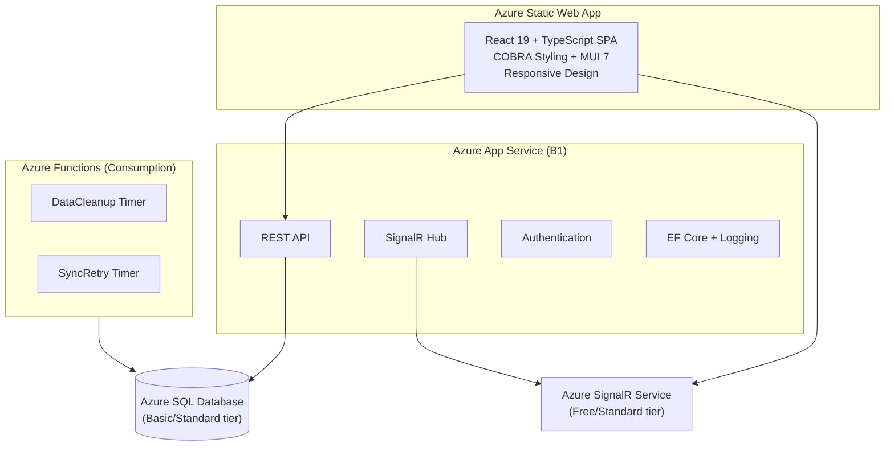

# CLAUDE.md - AI Assistant Guide

> **Last Updated:** 2025-01-09
> **Project:** Cadence - HSEEP MSEL Management Platform
> **Status:** Active Development

## Table of Contents

1. [Project Overview](#project-overview)
2. [Tech Stack & Architecture](#tech-stack--architecture)
3. [Project Structure](#project-structure)
4. [TDD Workflow (MANDATORY)](#tdd-workflow-mandatory)
5. [Agent Routing](#agent-routing)
6. [HSEEP Domain Reference](#hseep-domain-reference)
7. [Development Phases](#development-phases)
8. [User Story Reference](#user-story-reference)
9. [Database Patterns](#database-patterns)
10. [Development Environment](#development-environment)
11. [Code Conventions & Standards](#code-conventions--standards)
12. [COBRA Styling System](#cobra-styling-system)
13. [Adding New Features](#adding-new-features)
14. [Testing Guidelines](#testing-guidelines)
15. [Real-Time Events](#real-time-events)
16. [Azure Deployment](#azure-deployment)
17. [Troubleshooting](#troubleshooting)
18. [FAQ for AI Assistants](#faq-for-ai-assistants)

---

## Project Overview

### What is Cadence?

A **HSEEP-compliant MSEL management platform** focused on the **conduct phase** of emergency management exercises.

| Aspect | Value |
|--------|-------|
| **Target Users** | Emergency management professionals |
| **Primary Focus** | Exercise conduct (real-time inject management) |
| **Compliance** | HSEEP 2020 standards |
| **Key Differentiator** | Offline capability, affordable pricing |

### HSEEP Roles

Cadence implements five HSEEP-defined roles with exercise-scoped assignments:

| Role | Responsibilities |
|------|------------------|
| **Administrator** | System configuration, user management |
| **Exercise Director** | Overall exercise authority, Go/No-Go decisions |
| **Controller** | Delivers injects, manages scenario flow |
| **Evaluator** | Observes and documents player performance |
| **Observer** | Watches without interfering |

### CRITICAL: Read Documentation First

Before ANY work:

```
MUST READ (in order):
1. CLAUDE.md                       - This file (AI assistant instructions)
2. docs/COBRA_STYLING.md           - Typography, spacing, component patterns
3. docs/CODING_STANDARDS.md        - Code conventions
4. docs/features/                  - Feature requirements
5. .claude/agents/cadence-domain-agent.md - HSEEP terminology
```

---

## Tech Stack & Architecture

### Backend

| Technology            | Version            | Purpose                           |
|-----------------------|--------------------|-----------------------------------|
| .NET                  | 10.0 (LTS)         | Runtime                           |
| Azure App Service     | B1 tier            | **Primary REST API** (always warm) |
| Azure Functions       | Isolated Worker v4 | **Background jobs ONLY**          |
| Entity Framework Core | 10.0               | ORM                               |
| SQL Server            | 2019+ / Azure SQL  | Database                          |
| Serilog               | Latest             | Structured logging                |
| Azure SignalR         | Latest             | Real-time communication           |

### Frontend

| Technology            | Version  | Purpose                |
|-----------------------|----------|------------------------|
| React                 | 19.x     | UI framework           |
| TypeScript            | 5.x      | Type safety            |
| Vite                  | 7.x      | Build tool             |
| Material-UI           | 7.x      | Component library      |
| React Query           | Latest   | Server state management |
| Axios                 | 1.x      | HTTP client            |
| @microsoft/signalr    | 10.x     | Real-time client       |
| Vitest                | 4.x      | Test runner            |
| React Testing Library | 16.x     | Component testing      |

### Architecture Diagram



### Why App Service + Functions Hybrid?

| Component | Host | Reason |
|-----------|------|--------|
| REST API | App Service (B1) | Always warm - no cold starts for real-time exercise conduct |
| SignalR Hub | App Service | Persistent connections need always-on host |
| Data Cleanup | Azure Functions | Runs daily - scale to zero when idle |
| Sync Retry | Azure Functions | Runs periodically - scale to zero when idle |

### Core vs WebApi Separation

**Cadence.Core** - Domain/business logic (testable without web dependencies):
- Entities, DTOs, Mappers
- Services and interfaces
- `IExerciseHubContext` interface (abstraction only - NO SignalR package)

**Cadence.WebApi** - Web infrastructure (ASP.NET Core specific):
- Controllers
- SignalR Hubs (`ExerciseHub`, `ExerciseHubContext`)
- Program.cs, middleware, auth

This separation keeps Core testable and follows Dependency Inversion Principle.

---

## Project Structure

```
cadence/
├── .github/
│   ├── workflows/              # CI/CD pipelines
│   │   ├── ci.yml              # PR validation
│   │   ├── deploy-backend.yml  # Backend deployment
│   │   └── deploy-frontend.yml # Frontend deployment
│   └── ISSUE_TEMPLATE/
│
├── .claude/
│   └── agents/                 # Specialized AI agents
│       ├── cadence-domain-agent.md  # HSEEP terminology expert
│       ├── orchestrator.md
│       ├── infrastructure-agent.md
│       ├── frontend-agent.md
│       ├── backend-agent.md
│       ├── database-agent.md
│       ├── realtime-agent.md
│       ├── testing-agent.md
│       ├── azure-agent.md
│       ├── story-agent.md
│       ├── business-analyst-agent.md
│       └── code-review.md
│
├── src/
│   ├── Cadence.Functions/      # Azure Functions (background jobs)
│   │   ├── DataCleanupFunction.cs
│   │   └── SyncRetryFunction.cs
│   │
│   ├── Cadence.WebApi/         # Azure App Service (primary API)
│   │   ├── Controllers/
│   │   ├── Hubs/
│   │   │   ├── ExerciseHub.cs
│   │   │   └── ExerciseHubContext.cs
│   │   ├── Program.cs
│   │   └── appsettings*.json
│   │
│   ├── Cadence.Core/           # Shared business logic
│   │   ├── Data/
│   │   │   ├── AppDbContext.cs
│   │   │   └── AppDbContextFactory.cs
│   │   ├── Models/
│   │   │   └── Entities/
│   │   │       ├── BaseEntity.cs
│   │   │       ├── ISoftDeletable.cs
│   │   │       ├── Exercise.cs
│   │   │       ├── Msel.cs
│   │   │       ├── Inject.cs
│   │   │       └── Observation.cs
│   │   ├── Migrations/
│   │   │
│   │   ├── Features/           # Feature modules (backend)
│   │   │   ├── Exercises/
│   │   │   ├── Injects/
│   │   │   ├── Observations/
│   │   │   └── ExerciseClock/
│   │   │
│   │   ├── Hubs/
│   │   │   └── IExerciseHubContext.cs
│   │   │
│   │   └── Infrastructure/
│   │
│   ├── Cadence.Core.Tests/     # Backend tests
│   │   ├── Helpers/
│   │   │   └── TestDbContextFactory.cs
│   │   └── Features/
│   │       └── Exercises/
│   │           └── ExerciseServiceTests.cs
│   │
│   └── frontend/               # React SPA
│       └── src/
│           ├── core/           # App-wide infrastructure
│           │   └── services/
│           │       └── api.ts
│           │
│           ├── shared/         # Shared components/hooks
│           │   ├── components/
│           │   └── hooks/
│           │       └── useSignalR.ts
│           │
│           ├── features/       # Feature modules (frontend)
│           │   ├── exercises/
│           │   ├── injects/
│           │   ├── observations/
│           │   └── exercise-clock/
│           │
│           ├── contexts/
│           │   ├── AuthContext.tsx
│           │   └── ExerciseContext.tsx
│           │
│           ├── theme/          # COBRA styling
│           │
│           ├── App.tsx
│           └── main.tsx
│
├── scripts/                    # Development scripts
│   ├── start-dev.ps1
│   └── stop-dev.ps1
│
├── docs/
│   ├── features/               # Feature requirements
│   │   ├── README.md
│   │   ├── ROADMAP.md
│   │   ├── exercise-crud/
│   │   ├── inject-crud/
│   │   ├── excel-import-export/
│   │   ├── exercise-clock/
│   │   └── _cross-cutting/
│   ├── COBRA_STYLING.md
│   └── CODING_STANDARDS.md
│
├── CLAUDE.md                   # This file
├── README.md
└── .gitignore
```

---

## TDD Workflow (MANDATORY)

All development follows Test-Driven Development:

```
1. READ STORY      → Understand acceptance criteria in docs/features/
2. WRITE TESTS     → Each criterion → 1+ test cases (RED - tests fail)
3. IMPLEMENT       → Minimum code to pass tests (GREEN)
4. REFACTOR        → Clean up, keep tests green
5. VERIFY          → All criteria covered by passing tests
6. MARK COMPLETE   → Update story status
```

### Test Naming Conventions

**Backend (C#):**
```csharp
// Pattern: {Method}_{Scenario}_{ExpectedResult}
public async Task CreateExercise_ValidRequest_ReturnsCreatedExercise()
public async Task CreateExercise_EmptyName_ThrowsValidationException()
public async Task FireInject_PendingInject_SetsStatusToDelivered()
```

**Frontend (TypeScript):**
```typescript
// Pattern: describe('{Component}') → it('{behavior}')
describe('InjectRow', () => {
  it('renders inject number and description');
  it('shows fire button for Controllers with pending injects');
  it('calls onFire when fire button clicked');
});
```

---

## Agent Routing

This project uses specialized agents. Route work based on task type:

| Task Type | Agent | When to Use |
|-----------|-------|-------------|
| HSEEP terminology | `cadence-domain-agent` | Domain language, exercise conduct workflows |
| Multi-domain work | `orchestrator` | Tasks spanning frontend + backend + database |
| Phase 0 setup | `infrastructure-agent` | Initial setup, contracts |
| React/UI work | `frontend-agent` | Components, hooks, pages, COBRA styling |
| .NET API work | `backend-agent` | Controllers, services, App Service code |
| Schema changes | `database-agent` | Entities, migrations, EF Core |
| Live updates | `realtime-agent` | SignalR, WebSockets |
| Tests | `testing-agent` | Unit tests, integration tests, TDD |
| Infrastructure | `azure-agent` | Azure resources, CI/CD, deployment |
| Requirements | `business-analyst-agent` | User stories, acceptance criteria |
| Story tracking | `story-agent` | Story refinement, completion tracking |
| Quality | `code-review` | Code review, standards compliance |

### Explicit Invocation

```
> Use the backend-agent to create the InjectService
> Use the database-agent to design the Exercise entity
> Use the orchestrator to implement inject firing feature
> Use the cadence-domain-agent to verify HSEEP terminology
```

### Agent File Ownership

| Agent | Backend | Frontend |
|-------|---------|----------|
| Exercises | `Core/Features/Exercises/` | `features/exercises/` |
| Injects | `Core/Features/Injects/` | `features/injects/` |
| Observations | `Core/Features/Observations/` | `features/observations/` |
| Exercise Clock | `Core/Features/ExerciseClock/` | `features/exercise-clock/` |
| Real-Time | `Core/Hubs/` + `WebApi/Hubs/` | `shared/hooks/` |
| Infrastructure | `Models/`, `Data/`, `Hubs/` | `shared/`, `theme/`, `contexts/` |
| Testing | `*.Tests/` projects | `**/*.test.ts(x)` |

---

## HSEEP Domain Reference

### Key Terminology

| Term | Definition | Use |
|------|------------|-----|
| **Exercise** | Planned event to test capabilities | Top-level container |
| **MSEL** | Master Scenario Events List | Script of injects |
| **Inject** | Single scenario event | Deliverable to players |
| **Fire** | Deliver an inject | Action verb |
| **Controller** | Manages exercise flow | Role |
| **Evaluator** | Records observations | Role |
| **Scenario Time** | Time in the exercise story | Dual time tracking |
| **Wall Clock** | Actual real-world time | Dual time tracking |

### Exercise Types

| Type | Abbreviation | Description |
|------|--------------|-------------|
| Tabletop Exercise | TTX | Discussion-based |
| Functional Exercise | FE | Operations-based, simulated |
| Full-Scale Exercise | FSE | Operations-based, real resources |
| Computer-Aided Exercise | CAX | Uses simulation systems |

### Inject Statuses

| Status | Meaning |
|--------|---------|
| Pending | Not yet delivered |
| Delivered | Fired by Controller |
| Skipped | Intentionally not delivered |
| Deferred | Postponed for later |

### Terminology Rules

**DO Use:**
- "Fire an inject" (not "send" or "trigger")
- "Exercise Director" (not "admin")
- "Controllers" (not "facilitators")
- "MSEL" (not "script" or "event list")

**DON'T Use:**
- "Game" or "gaming" (use "exercise")
- "Trigger" for injects (use "fire")
- "User" for participants (use "player" or role name)

---

## Development Phases

From `docs/features/ROADMAP.md`:

### MVP Phase (18 features)
- Exercise CRUD
- Inject CRUD
- Excel Import/Export
- Exercise Clock
- Authentication & RBAC
- Offline Capability

### Standard Phase (11 features)
- Inject Filtering & Sorting
- Branching Injects
- Observations
- Progress Dashboard

### Advanced Phase (10 features)
- Auto-fire with Confirmation
- Multi-MSEL Support
- Document Generation

---

## User Story Reference

Stories are in `docs/features/{feature-name}/`:

```
docs/features/
├── exercise-crud/
│   ├── FEATURE.md
│   ├── S01-create-exercise.md
│   └── S02-edit-exercise.md
├── inject-crud/
│   ├── FEATURE.md
│   └── S01-create-inject.md
└── _cross-cutting/
    └── S01-authentication.md
```

Story file format uses `S##` numbering within each feature folder.

---

## Database Patterns

### MANDATORY: BaseEntity

All user-created entities inherit from `BaseEntity`:

```csharp
public abstract class BaseEntity : IHasTimestamps, ISoftDeletable
{
    public Guid Id { get; set; }
    
    // IHasTimestamps - Set automatically by DbContext
    public DateTime CreatedAt { get; set; }
    public DateTime UpdatedAt { get; set; }
    
    // ISoftDeletable - Use soft delete for all user data
    public bool IsDeleted { get; set; }
    public DateTime? DeletedAt { get; set; }
    public Guid? DeletedBy { get; set; }
}
```

### Core Entities

| Entity | Purpose |
|--------|---------|
| `Exercise` | Main container for an exercise |
| `Msel` | Master Scenario Events List |
| `Inject` | Single scenario event |
| `ExerciseUser` | Role assignment per exercise |
| `ExercisePhase` | Time segment of exercise |
| `Observation` | Evaluator notes |

### DbContext Configuration

The DbContext MUST include:

1. **Automatic timestamps** via `SaveChanges` override
2. **Global `datetime2`** column type for all DateTime properties
3. **Global soft delete** query filters

---

## Development Environment

### Prerequisites

- **.NET 10 SDK**: `dotnet --version`
- **Node.js 20+**: `node --version`
- **SQL Server 2019+** or **LocalDB**

### Initial Setup

#### 1. Clone and Configure

```bash
git clone https://github.com/your-org/cadence.git
cd cadence
```

#### 2. Backend Setup

```bash
cd src/Cadence.WebApi

# Copy example settings
cp appsettings.Local.example.json appsettings.Local.json

# Edit with your connection string

# Restore and run
dotnet restore
dotnet ef database update
dotnet run
```

#### 3. Frontend Setup

```bash
cd src/frontend

cp .env.example .env
npm install
npm run dev
```

### Development Scripts

```powershell
# Start both backend and frontend
.\scripts\start-dev.ps1

# Stop all dev processes
.\scripts\stop-dev.ps1
```

---

## Code Conventions & Standards

### C# Backend

#### Naming Conventions

```csharp
// Classes: PascalCase
public class ExerciseService { }

// Interfaces: IPascalCase
public interface IExerciseService { }

// Private fields: _camelCase
private readonly AppDbContext _context;

// Parameters/locals: camelCase
public void CreateExercise(string name) { }
```

#### Namespace Convention

```csharp
namespace Cadence.Core.Features.Exercises.Services;
namespace Cadence.Core.Features.Injects.Models.DTOs;
namespace Cadence.WebApi.Controllers;
namespace Cadence.WebApi.Hubs;
```

### TypeScript Frontend

#### Naming Conventions

```typescript
// Components: PascalCase
export const ExerciseList: React.FC = () => {};

// Interfaces/Types: PascalCase
export interface ExerciseDto { }

// Variables/functions: camelCase
const handleFire = () => {};

// Custom hooks: useCamelCase
export const useExercises = () => {};
```

---

## COBRA Styling System

### Critical Rule

**NEVER import raw MUI components for styled elements. ALWAYS use COBRA components.**

```typescript
// ❌ NEVER DO THIS
import { Button, TextField } from '@mui/material';

// ✅ ALWAYS DO THIS
import { CobraPrimaryButton, CobraTextField } from '@/theme/styledComponents';
```

### Available Components

| Component | Use Case |
|-----------|----------|
| `CobraPrimaryButton` | Primary actions (Save, Create, Fire) |
| `CobraSecondaryButton` | Secondary actions |
| `CobraDeleteButton` | Destructive actions |
| `CobraLinkButton` | Text-only actions |
| `CobraTextField` | All text inputs |

---

## Adding New Features

### Backend Pattern

```
src/Cadence.Core/Features/{FeatureName}/
├── Services/
│   ├── I{Feature}Service.cs
│   └── {Feature}Service.cs
├── Models/
│   ├── Entities/
│   │   └── {Entity}.cs
│   └── DTOs/
│       └── {Entity}Dtos.cs
├── Mappers/
│   └── {Entity}Mapper.cs
├── Validators/
│   └── {Entity}Validators.cs
└── README.md
```

### Frontend Pattern

```
src/frontend/src/features/{featureName}/
├── components/
├── pages/
│   ├── {Feature}Page.tsx
│   └── {Feature}Page.test.tsx
├── hooks/
│   ├── use{Feature}.ts
│   └── use{Feature}.test.ts
├── services/
│   └── {feature}Service.ts
├── types/
│   └── index.ts
└── README.md
```

---

## Real-Time Events

### Backend: Broadcasting Events

Use `IExerciseHubContext` from Core:

```csharp
await _hubContext.NotifyInjectFired(exerciseId, injectDto);
await _hubContext.NotifyExerciseClockChanged(exerciseId, clockState);
```

### Frontend: Subscribing to Events

```typescript
useEffect(() => {
  if (!connection) return;

  connection.on('InjectFired', (inject) => {
    queryClient.invalidateQueries(['injects', exerciseId]);
  });

  return () => connection.off('InjectFired');
}, [connection]);
```

### Event Names

| Event | When |
|-------|------|
| `InjectFired` | Controller fires inject |
| `InjectStatusChanged` | Status update |
| `ClockStarted` | Exercise clock starts |
| `ClockPaused` | Exercise clock pauses |
| `ObservationAdded` | Evaluator adds observation |

---

## Azure Deployment

### Resources Required

| Resource | SKU | Monthly Cost |
|----------|-----|--------------|
| App Service | B1 | ~$13 |
| Azure SQL | Basic | ~$5 |
| SignalR | Free | $0 |
| Functions | Consumption | ~$0-1 |
| Storage | Standard LRS | ~$0.50 |
| **Total** | | **~$20/month** |

---

## FAQ for AI Assistants

**Q: What's the primary architecture pattern?**
A: Modular "features" architecture. Each feature is self-contained in `src/Cadence.Core/Features/{FeatureName}` and `src/frontend/src/features/{featureName}`.

**Q: Why App Service instead of Azure Functions for the API?**
A: Exercise conduct needs instant responses. App Service (B1) is always warm with no cold starts. Functions are used only for background timer triggers.

**Q: What HSEEP terminology should I use?**
A: See `cadence-domain-agent.md` or the HSEEP Domain Reference section. Key terms: "fire" (not trigger), "inject" (not event), "Controller" (not facilitator).

**Q: Should I use raw MUI components?**
A: **No.** Always use COBRA styled components from `@/theme/styledComponents`.

**Q: Where do I put business logic?**
A: Backend: `Services/` layer in Core. Frontend: Custom hooks (`hooks/`).

**Q: What's the testing strategy?**
A: **TDD is mandatory.** Write tests for acceptance criteria FIRST. Backend tests in separate project. Frontend tests colocated with source files.

**Q: How do I handle real-time features?**
A: Use Azure SignalR Service. Backend: Inject `IExerciseHubContext` (from Core). Frontend: Use `useSignalR` hook.

**Q: Where does SignalR code live?**
A: Interface (`IExerciseHubContext`) in `Cadence.Core/Hubs/` - no SignalR dependency. Implementation (`ExerciseHub`, `ExerciseHubContext`) in `Cadence.WebApi/Hubs/`.

**Q: What are the user roles?**
A: HSEEP roles: Administrator, Exercise Director, Controller, Evaluator, Observer. Roles are assigned per-exercise (except Administrator which is system-wide).

**Q: How is time tracked?**
A: Dual time: Scenario Time (within the exercise story) and Wall Clock (actual delivery time). Both are recorded when an inject is fired.

**Q: Where are requirements documented?**
A: `docs/features/{feature-name}/` with FEATURE.md overview and S##-*.md story files.

---

## Change Log

| Date       | Version | Changes |
|------------|---------|---------|
| 2025-01-09 | 1.0.0   | Initial Cadence CLAUDE.md - HSEEP MSEL platform |

---

**For questions or issues, refer to:**

- `README.md` - Project overview and quick start
- `docs/CODING_STANDARDS.md` - Detailed coding conventions
- `docs/COBRA_STYLING.md` - Complete styling guide
- `docs/features/` - Feature requirements
- `.claude/agents/` - Specialized AI agent documentation
- `.claude/agents/cadence-domain-agent.md` - HSEEP terminology reference
