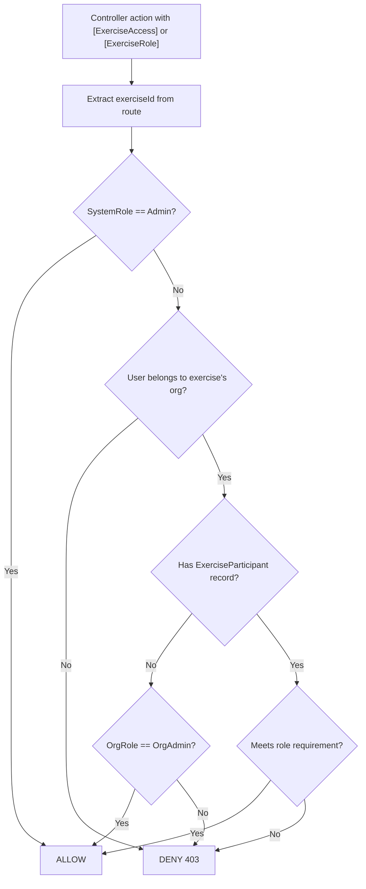
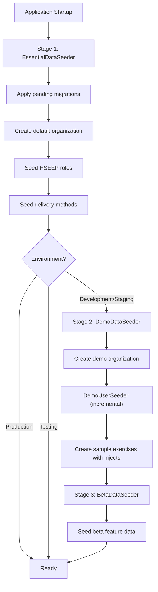
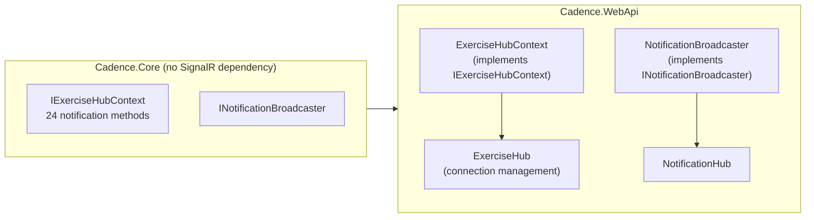
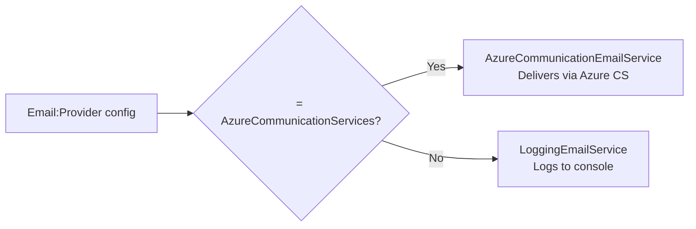

# Backend Architecture

> **Last Updated:** 2026-03-06 | **Version:** 2.0

This document maps the .NET backend: project structure, feature modules, service layer patterns, dependency injection, middleware pipeline, data access, and real-time infrastructure.

---

## Project Layout

```
src/
├── Cadence.Core/                    # Domain logic (no web dependencies)
│   ├── Core/Extensions/             # DI registration
│   ├── Data/                        # DbContext, seeders, interceptors
│   ├── Features/                    # 26 feature modules
│   ├── Hubs/                        # Hub interfaces (abstraction only)
│   ├── Logging/                     # Structured logging helpers
│   ├── Migrations/                  # 125+ EF Core migrations
│   └── Models/Entities/             # 45+ entity classes + enums
│
├── Cadence.WebApi/                  # ASP.NET Core API (App Service)
│   ├── Authorization/               # Policy handlers and requirements
│   ├── Controllers/                 # 36 API controllers
│   ├── Extensions/                  # App builder extensions
│   ├── Hubs/                        # SignalR hub implementations
│   ├── Middleware/                   # Request logging, Serilog enrichment
│   ├── Services/                    # Web-specific services
│   └── Program.cs                   # Pipeline configuration
│
├── Cadence.Functions/               # Azure Functions (background jobs)
│
└── Cadence.Core.Tests/              # 47 test files
    ├── Features/                    # Feature-organized tests
    └── Helpers/                     # Test utilities
```

### Core vs WebApi Separation

| Project | Purpose | May Reference |
|---------|---------|---------------|
| **Cadence.Core** | Domain logic, entities, services, data access | EF Core, FluentValidation, Identity (no ASP.NET Core, no SignalR) |
| **Cadence.WebApi** | HTTP pipeline, controllers, SignalR hubs, middleware | ASP.NET Core, SignalR, references Core |

Key pattern: `IExerciseHubContext` is defined in Core (interface only, no SignalR package). The SignalR implementation `ExerciseHubContext` lives in WebApi. This keeps Core unit-testable without web infrastructure.

---

## Feature Module Inventory (26 Modules)

Each feature follows the convention:

```
Features/{FeatureName}/
├── Services/
│   ├── I{Feature}Service.cs         # Interface
│   └── {Feature}Service.cs          # Implementation
├── Models/
│   ├── DTOs/{Feature}Dtos.cs        # Data transfer objects
│   └── Entities/{Entity}.cs         # Feature-owned entities (rare)
├── Mappers/{Entity}Mapper.cs        # Manual mappers (no AutoMapper)
└── Validators/{Entity}Validators.cs # FluentValidation rules
```

### Core Domain Features

| Module | Services | Key Responsibility |
|--------|----------|--------------------|
| **Exercises** | ExerciseStatusService, ExerciseDeleteService, ExerciseParticipantService, ExerciseApprovalSettingsService, ExerciseApprovalQueueService, ApprovalPermissionService, ExerciseCapabilityService, SetupProgressService | Exercise lifecycle, participants, approval workflow, capability targeting |
| **Injects** | InjectService, InjectReadinessService | Inject CRUD, status transitions (fire/skip/reset), clock-driven readiness |
| **Msel** | MselService | MSEL version management |
| **Observations** | ObservationService | Evaluator observations with P/S/M/U ratings |
| **Objectives** | ObjectiveService | Exercise objective tracking |
| **Phases** | *(DTOs only)* | Exercise phase/segment definitions |
| **ExpectedOutcomes** | ExpectedOutcomeService | Expected inject outcomes |
| **ExerciseClock** | ExerciseClockService | Start/pause/stop clock, elapsed time calculation |

### Organization & Identity Features

| Module | Services | Key Responsibility |
|--------|----------|--------------------|
| **Organizations** | OrganizationService, MembershipService, OrganizationInvitationService | Organization CRUD, member management, invitation workflow |
| **Authentication** | AuthenticationService, JwtTokenService, RefreshTokenStore | Login/register, JWT generation, token refresh, password reset |
| **Authorization** | RoleResolver | Exercise role resolution from ExerciseParticipant records |
| **Users** | UserService, UserPreferencesService | User management, theme/density/time format preferences |
| **Assignments** | AssignmentService | Cross-exercise role assignments for current user |

### Evaluation Features

| Module | Services | Key Responsibility |
|--------|----------|--------------------|
| **Eeg** | CapabilityTargetService, CriticalTaskService, EegEntryService, EegDocumentService, EegExportService | Exercise Evaluation Guide: capability targets, critical tasks, evaluation entries, document generation |
| **Capabilities** | CapabilityService, CapabilityImportService, PredefinedLibraryProvider | Capability library management, FEMA/NATO/NIST/ISO framework import |
| **Metrics** | ExerciseMetricsService, InjectMetricsService, ObservationMetricsService, ProgressMetricsService, TimelineMetricsService | Dashboard analytics: inject delivery rates, evaluator coverage, timeline analysis |

### Import/Export Features

| Module | Services | Key Responsibility |
|--------|----------|--------------------|
| **ExcelImport** | ExcelImportService, LegacyExcelReader, TimeParsingHelper | Import MSELs from .xlsx/.xls files with column mapping |
| **ExcelExport** | ExcelExportService | Export MSELs to Excel format |
| **BulkParticipantImport** | BulkParticipantImportService, ParticipantClassificationService, ParticipantFileParser | CSV/Excel participant import with classification and assignment |

### Communication Features

| Module | Services | Key Responsibility |
|--------|----------|--------------------|
| **Email** | AzureCommunicationEmailService, LoggingEmailService, EmailLogService, EmailPreferenceService, PlaceholderEmailTemplateRenderer, AuthenticationEmailService, EmailTemplateRegistrar | Email delivery (ACS or logging), templates, preferences, audit logging |
| **Notifications** | NotificationService, ApprovalNotificationService, NotificationBroadcaster | In-app notifications, approval workflow notifications, real-time broadcasting |
| **Feedback** | FeedbackService, GitHubIssueService | User feedback collection, automatic GitHub issue creation |

### Supporting Features

| Module | Services | Key Responsibility |
|--------|----------|--------------------|
| **Photos** | PhotoService, IBlobStorageService | Photo capture/upload, blob storage abstraction (Azure or local) |
| **DeliveryMethods** | DeliveryMethodService | Inject delivery method lookup management |
| **Autocomplete** | AutocompleteService, OrganizationSuggestionService | Field autocomplete, organization-scoped suggestions |
| **SystemSettings** | SystemSettingsService, EulaService, EmailConfigurationProvider | Platform settings, EULA acceptance tracking, email config resolution |

---

## Dependency Injection

All services are registered in `Core/Extensions/ServiceCollectionExtensions.cs`.

### Registration Pattern

```csharp
public static IServiceCollection AddApplicationServices(this IServiceCollection services)
{
    // FluentValidation - auto-discover validators from Core assembly
    services.AddValidatorsFromAssemblyContaining<AppDbContext>();

    // Feature services (Scoped = per-request lifetime)
    services.AddScoped<IInjectService, InjectService>();
    services.AddScoped<IExerciseClockService, ExerciseClockService>();
    // ... 60+ registrations

    // Singleton services (shared across requests)
    services.AddSingleton<IPredefinedLibraryProvider, PredefinedLibraryProvider>();
    services.AddSingleton<InMemoryEmailTemplateStore>(...);

    return services;
}
```

### Registration by Lifetime

| Lifetime | Count | Examples |
|----------|-------|---------|
| **Scoped** | ~60 | All feature services, DbContext, AuthenticationService |
| **Singleton** | 4 | PredefinedLibraryProvider, OrganizationValidationInterceptor, InMemoryEmailTemplateStore, IEmailTemplateStore |
| **Hosted** | 1 | InjectReadinessBackgroundService |

### WebApi-Only Registrations (Program.cs)

These services depend on ASP.NET Core and are registered in `Program.cs`:

| Service | Interface | Purpose |
|---------|-----------|---------|
| `ExerciseHubContext` | `IExerciseHubContext` | SignalR hub broadcasting |
| `NotificationBroadcaster` | `INotificationBroadcaster` | Notification hub broadcasting |
| `CurrentOrganizationContext` | `ICurrentOrganizationContext` | Extracts org claims from JWT |
| `JwtTokenService` | `ITokenService` | JWT generation |
| `RefreshTokenStore` | `IRefreshTokenStore` | Refresh token management |
| `AuthenticationService` | `IAuthenticationService` | Login/register orchestration |
| `AzureBlobStorageService` / `LocalFileBlobStorageService` | `IBlobStorageService` | Photo storage (config-driven) |
| `AzureCommunicationEmailService` / `LoggingEmailService` | `IEmailService` | Email delivery (config-driven) |
| `InjectReadinessBackgroundService` | `IHostedService` | Clock-driven inject readiness |

---

## Middleware Pipeline

Middleware executes in this exact order (from `Program.cs`):

```
Request
  │
  ├── 1. OpenAPI / Scalar API docs
  ├── 2. HTTPS Redirection
  ├── 3. Static Files (wwwroot/uploads/ for local photos)
  ├── 4. CORS (AllowAnyOrigin in dev, configured origins in prod)
  ├── 5. Rate Limiter
  │       ├── "auth" policy: 10 req/min per IP
  │       └── "password-reset" policy: 3 req/15min per IP
  ├── 6. RequestResponseLoggingMiddleware (logs 4xx/5xx with body details)
  ├── 7. Authentication (JWT Bearer validation)
  ├── 8. SerilogContextMiddleware (enriches logs with UserId, OrgId, ExerciseId)
  ├── 9. Authorization (policies + exercise access handlers)
  ├── 10. Serilog Request Logging (structured HTTP request summaries)
  ├── 11. Global Exception Handler (500 responses, dev stack traces)
  │
  ├── MapControllers() → 36 API controllers
  └── MapHub<ExerciseHub>("/hubs/exercise")
```

### Custom Middleware

| Middleware | File | Purpose |
|-----------|------|---------|
| `RequestResponseLoggingMiddleware` | `WebApi/Middleware/RequestResponseLoggingMiddleware.cs` | Captures request/response bodies for 4xx and 5xx responses for debugging |
| `SerilogContextMiddleware` | `WebApi/Middleware/SerilogContextMiddleware.cs` | Enriches Serilog `LogContext` with `UserId`, `OrganizationId`, and `ExerciseId` from JWT claims and route values |

---

## Authorization System

### Policies and Handlers

| Component | File | Purpose |
|-----------|------|---------|
| `AuthorizationExtensions` | `Authorization/AuthorizationExtensions.cs` | Registers all policies and handlers |
| `PolicyNames` | `Authorization/PolicyNames.cs` | String constants for policy names |
| `AuthorizeAttributes` | `Authorization/AuthorizeAttributes.cs` | Custom `[Authorize]` attribute shortcuts |
| `ExerciseAccessHandler` | `Authorization/Handlers/ExerciseAccessHandler.cs` | Verifies user can access a specific exercise |
| `ExerciseRoleHandler` | `Authorization/Handlers/ExerciseRoleHandler.cs` | Verifies user has required exercise role |
| `AuthorizationLoggingHandler` | `Authorization/Handlers/AuthorizationLoggingHandler.cs` | Logs all authorization decisions |
| `ExerciseAccessRequirement` | `Authorization/Requirements/ExerciseAccessRequirement.cs` | Policy requirement for exercise access |
| `ExerciseRoleRequirement` | `Authorization/Requirements/ExerciseRoleRequirement.cs` | Policy requirement for specific role |

### Authorization Flow



---

## Data Access Layer

### AppDbContext

**File:** `Core/Data/AppDbContext.cs`

Key responsibilities:
- **45+ DbSet declarations** for all entities
- **Automatic timestamps:** `SaveChangesAsync` override sets `CreatedAt`/`UpdatedAt` and `CreatedBy`/`ModifiedBy`
- **Global query filters:** All entities with `ISoftDeletable` get `WHERE IsDeleted = false`
- **Global column type:** All `DateTime` properties use `datetime2` SQL type
- **Entity configuration:** Fluent API for indexes, relationships, and constraints

### Interceptors

| Interceptor | File | Lifetime | Purpose |
|-------------|------|----------|---------|
| `OrganizationValidationInterceptor` | `Data/Interceptors/OrganizationValidationInterceptor.cs` | Singleton | Validates that `IOrganizationScoped` entities being saved have the correct `OrganizationId` matching the current user's organization |

### Database Configuration

```csharp
services.AddDbContext<AppDbContext>((sp, options) =>
{
    options.UseSqlServer(connectionString, sql =>
    {
        sql.EnableRetryOnFailure(maxRetryCount: 3, maxRetryDelay: 10s);
        sql.CommandTimeout(30);
    });
    options.AddInterceptors(sp.GetRequiredService<OrganizationValidationInterceptor>());
});
```

---

## Data Seeding Strategy



| Seeder | File | Environments | Purpose |
|--------|------|-------------|---------|
| `EssentialDataSeeder` | `Data/EssentialDataSeeder.cs` | All | Migrations, default org, HSEEP roles, delivery methods |
| `DemoDataSeeder` | `Data/DemoDataSeeder.cs` | Non-Production, Non-Testing | Demo organization, sample exercises |
| `DemoUserSeeder` | `Data/DemoUserSeeder.cs` | Non-Production, Non-Testing | Demo users (incremental - only adds new users) |
| `BetaDataSeeder` | `Data/BetaDataSeeder.cs` | Non-Production, Non-Testing | Beta feature seed data |

---

## Background Services

| Service | File | Purpose |
|---------|------|---------|
| `InjectReadinessBackgroundService` | `WebApi/Services/InjectReadinessBackgroundService.cs` | Monitors running exercise clocks and transitions injects to "Ready" status when clock elapsed time reaches their `DeliveryTime`. Runs on a periodic timer while any exercise clock is active. |

---

## SignalR Infrastructure

### Hub Architecture



### Hub Endpoints

| Hub | Route | Groups | Purpose |
|-----|-------|--------|---------|
| `ExerciseHub` | `/hubs/exercise` | `exercise-{exerciseId}` | Exercise real-time updates (injects, clock, observations) |
| `NotificationHub` | *(via NotificationBroadcaster)* | `user-{userId}` | Per-user notifications |

### Connection Lifecycle

```csharp
// ExerciseHub.cs
public override async Task OnConnectedAsync()
{
    // Client sends exerciseId → added to exercise group
    await Groups.AddToGroupAsync(Context.ConnectionId, $"exercise-{exerciseId}");
}
```

Services broadcast events through the hub context interface:

```csharp
// In any Core service
await _hubContext.NotifyInjectFired(exerciseId, injectDto);
// ExerciseHubContext sends to exercise group via SignalR
```

See [SIGNALR_EVENTS.md](./SIGNALR_EVENTS.md) for the complete event catalog.

---

## Blob Storage

Photo uploads support two providers, selected by configuration:

| Provider | Class | Config | Use Case |
|----------|-------|--------|----------|
| **Azure Blob Storage** | `AzureBlobStorageService` | `Azure:BlobStorage:ConnectionString` set | Production (Azure Storage) or dev (Azurite) |
| **Local File System** | `LocalFileBlobStorageService` | `Azure:BlobStorage:Provider=Local` or no connection string | Development without Azurite |

Both implement `IBlobStorageService` (defined in Core).

---

## Email System

### Provider Selection



### Email Architecture

| Component | Purpose |
|-----------|---------|
| `InMemoryEmailTemplateStore` | Singleton store of all email templates |
| `EmailTemplateRegistrar` | Registers templates at startup |
| `PlaceholderEmailTemplateRenderer` | Renders templates with `{{placeholder}}` replacement |
| `EmailLogService` | Persists email send history for audit |
| `EmailPreferenceService` | Per-user email opt-in/out preferences |
| `AuthenticationEmailService` | Sends auth-specific emails (password reset, welcome) |
| `EmailConfigurationProvider` | Resolves effective email config (system settings + overrides) |

### Email Models

Templates are defined as typed model classes:

| Model | Emails |
|-------|--------|
| `AuthEmailModels` | Welcome, password reset, account locked |
| `ExerciseEmailModels` | Exercise invitation, participant added |
| `ExerciseStatusEmailModels` | Exercise activated, completed, archived |
| `WorkflowEmailModels` | Inject submitted, approved, rejected |
| `ReminderEmailModels` | Upcoming exercise reminders |
| `DigestEmailModels` | Activity digest summaries |
| `SupportEmailModels` | Support ticket confirmation |

---

## JSON Serialization

Configured identically for both controllers and SignalR:

```csharp
options.JsonSerializerOptions.PropertyNamingPolicy = JsonNamingPolicy.CamelCase;
options.JsonSerializerOptions.Converters.Add(new ApprovalRolesJsonConverter()); // [Flags] → integer
options.JsonSerializerOptions.Converters.Add(new JsonStringEnumConverter());    // Other enums → string
```

**Important:** `ApprovalRoles` is a `[Flags]` enum serialized as integer (not string) so the frontend can perform bitwise operations. The custom `ApprovalRolesJsonConverter` is registered before `JsonStringEnumConverter` to take precedence.

---

## Logging

### Serilog Configuration

```
Bootstrap Logger (startup)
  └── Full Logger (runtime, from appsettings)
      ├── Console sink (always)
      ├── Application Insights sink (when configured)
      └── Enrichers: LogContext, EnvironmentName, ThreadId, "Cadence.WebApi"
```

### Log Enrichment

The `SerilogContextMiddleware` adds these properties to every request's log context:

| Property | Source |
|----------|--------|
| `UserId` | JWT `sub` claim |
| `OrganizationId` | JWT `org_id` claim |
| `ExerciseId` | Route value `exerciseId` |

### Telemetry

Application Insights is configured with adaptive sampling:
- **All exceptions and failed requests** are captured (no sampling)
- **Successful requests** use adaptive sampling to control volume

---

## Testing Patterns

### Test Organization

```
Cadence.Core.Tests/
├── Helpers/
│   └── TestDbContextFactory.cs    # Creates InMemory DbContext for tests
└── Features/
    ├── Assignments/AssignmentServiceTests.cs
    ├── Authentication/
    │   ├── AuthenticationServiceTests.cs
    │   ├── JwtTokenServiceTests.cs
    │   └── RefreshTokenStoreTests.cs
    ├── Exercises/
    │   ├── ExerciseApprovalQueueTests.cs
    │   ├── ExerciseApprovalSettingsServiceTests.cs
    │   ├── ExerciseAssignmentServiceTests.cs
    │   ├── ExerciseCapabilityServiceTests.cs
    │   ├── ExerciseDeleteServiceTests.cs
    │   ├── ExerciseDirectorSelectionTests.cs
    │   └── ExerciseStatusServiceTests.cs
    ├── Injects/
    │   ├── InjectReadinessServiceTests.cs
    │   └── InjectServiceTests.cs
    └── ... (47 test files total)
```

### Test Coverage by Feature

| Feature | Test Files | Coverage Focus |
|---------|-----------|----------------|
| Exercises | 7 | Status transitions, delete rules, approval queue, director selection |
| Email | 6 | Template rendering, logging, preferences, provider selection |
| Authentication | 3 | Login flow, JWT generation, token refresh |
| Organizations | 3 | CRUD, membership management, invitations |
| BulkParticipantImport | 3 | File parsing, classification, import orchestration |
| Capabilities | 3 | CRUD, predefined library import |
| SystemSettings | 3 | Settings management, EULA, email configuration |
| Injects | 2 | CRUD, status transitions, readiness |
| Notifications | 2 | Delivery, approval notifications |
| ExcelImport | 2 | Import service, time parsing |
| Users | 2 | User management, preferences |
| EEG | 2 | Critical tasks, document generation |
| All other features | 1 each | Core service functionality |

### Test Naming Convention

```csharp
[Fact]
public async Task CreateExercise_ValidRequest_ReturnsCreatedExercise()

[Fact]
public async Task FireInject_PendingInject_SetsStatusToDelivered()

// Pattern: {Method}_{Scenario}_{ExpectedResult}
```

---

## Key Patterns

### Service Layer Pattern

All services follow this pattern:

```csharp
public class InjectService : IInjectService
{
    private readonly AppDbContext _context;
    private readonly IExerciseHubContext _hubContext;
    private readonly ICurrentOrganizationContext _orgContext;
    private readonly ILogger<InjectService> _logger;

    // Constructor injection of all dependencies
    // No business logic in constructors

    public async Task<InjectDto> FireInjectAsync(Guid exerciseId, Guid injectId, string userId)
    {
        // 1. Load entity with includes
        // 2. Validate business rules
        // 3. Mutate state
        // 4. Save changes
        // 5. Broadcast via SignalR
        // 6. Return DTO (mapped manually)
    }
}
```

### Manual Mapping (No AutoMapper)

DTOs are mapped manually via static mapper classes:

```csharp
public static class OrganizationMapper
{
    public static OrganizationDto ToDto(Organization entity) => new()
    {
        Id = entity.Id,
        Name = entity.Name,
        // ...
    };
}
```

### Validation

FluentValidation validators are auto-discovered from the Core assembly and injected where needed:

```csharp
services.AddValidatorsFromAssemblyContaining<AppDbContext>();
```

---

## Related Documents

- [OVERVIEW.md](./OVERVIEW.md) - System architecture and deployment
- [DATA_MODEL.md](./DATA_MODEL.md) - Entity relationships and database schema
- [API_DESIGN.md](./API_DESIGN.md) - REST API endpoint catalog
- [ROLE_ARCHITECTURE.md](./ROLE_ARCHITECTURE.md) - Three-tier role hierarchy
- [FRONTEND_ARCHITECTURE.md](./FRONTEND_ARCHITECTURE.md) - React application map
- [FEATURE_INVENTORY.md](./FEATURE_INVENTORY.md) - Cross-reference feature catalog
- [SIGNALR_EVENTS.md](./SIGNALR_EVENTS.md) - Real-time event reference
