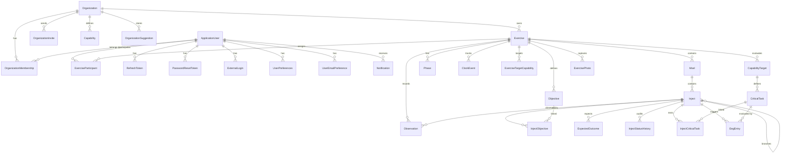

# Data Model

> **Last Updated:** 2026-03-06 | **Version:** 2.0

This document describes the database schema, entity relationships, and data access patterns used in Cadence.

---

## Entity Relationship Diagram



---

## BaseEntity Pattern

All user-created entities inherit from `BaseEntity`:

**File:** `src/Cadence.Core/Models/Entities/BaseEntity.cs`

```csharp
public abstract class BaseEntity : IHasTimestamps, ISoftDeletable
{
    public Guid Id { get; set; }

    // IHasTimestamps - Set automatically by DbContext.SaveChanges()
    public DateTime CreatedAt { get; set; }
    public DateTime UpdatedAt { get; set; }
    public string CreatedBy { get; set; }    // ApplicationUser ID
    public string ModifiedBy { get; set; }   // ApplicationUser ID

    // ISoftDeletable - Soft delete for all user data
    public bool IsDeleted { get; set; }
    public DateTime? DeletedAt { get; set; }
    public string? DeletedBy { get; set; }
}
```

**Rules:**
- `CreatedAt`/`UpdatedAt` are set automatically in `AppDbContext.SaveChangesAsync()`
- `IsDeleted` entities are excluded by global query filters
- All `DateTime` properties stored as `datetime2` (global convention)
- Default `CreatedBy`/`ModifiedBy` is `SystemConstants.SystemUserIdString`

---

## Organization-Scoped Entities

**File:** `src/Cadence.Core/Models/Entities/IOrganizationScoped.cs`

```csharp
public interface IOrganizationScoped
{
    Guid OrganizationId { get; set; }
    Organization Organization { get; set; }
}
```

Entities implementing `IOrganizationScoped` are automatically filtered by `AppDbContext` global query filters to the current user's organization.

---

## Entity Catalog

### Core Domain Entities

| Entity | File | Inherits | Org-Scoped | Purpose |
|--------|------|----------|-----------|---------|
| `Organization` | `Organization.cs` | BaseEntity | No | Multi-tenancy boundary |
| `Exercise` | `Exercise.cs` | BaseEntity | **Yes** | Top-level exercise container |
| `Msel` | `Msel.cs` | BaseEntity | No | Master Scenario Events List (via Exercise) |
| `Inject` | `Inject.cs` | BaseEntity | No | Scenario event / message (via Msel) |
| `Phase` | `Phase.cs` | BaseEntity | No | Exercise time segment (via Exercise) |
| `Objective` | `Objective.cs` | BaseEntity | No | Exercise objective (via Exercise) |
| `Observation` | `Observation.cs` | BaseEntity | No | Evaluator notes (via Exercise) |
| `ExpectedOutcome` | `ExpectedOutcome.cs` | BaseEntity | No | Expected inject response (via Inject) |
| `Capability` | `Capability.cs` | BaseEntity | No | Emergency capability definition |
| `CapabilityTarget` | `CapabilityTarget.cs` | BaseEntity | No | EEG capability target (via Exercise) |
| `CriticalTask` | `CriticalTask.cs` | BaseEntity | No | EEG critical task (via CapabilityTarget) |
| `EegEntry` | `EegEntry.cs` | BaseEntity | No | EEG evaluation entry (via Exercise) |
| `ExercisePhoto` | `ExercisePhoto.cs` | BaseEntity | No | Photo captured during exercise |

### Identity & Authentication

| Entity | File | Inherits | Purpose |
|--------|------|----------|---------|
| `ApplicationUser` | `ApplicationUser.cs` | IdentityUser | Platform user (ASP.NET Identity) |
| `RefreshToken` | `RefreshToken.cs` | BaseEntity | JWT refresh token storage |
| `PasswordResetToken` | `PasswordResetToken.cs` | BaseEntity | Password reset flow |
| `ExternalLogin` | `ExternalLogin.cs` | BaseEntity | OAuth/social login |

### Membership & Roles

| Entity | File | Inherits | Purpose |
|--------|------|----------|---------|
| `OrganizationMembership` | `OrganizationMembership.cs` | BaseEntity | User-to-org membership with OrgRole |
| `OrganizationInvite` | `OrganizationInvite.cs` | BaseEntity | Pending org invitation |
| `ExerciseParticipant` | `ExerciseParticipant.cs` | BaseEntity | User-to-exercise role assignment |
| `HseepRole` | `HseepRole.cs` | - | HSEEP role definitions (seed data) |

### Junction Tables

| Entity | File | Links | Purpose |
|--------|------|-------|---------|
| `InjectObjective` | `InjectObjective.cs` | Inject <-> Objective | Many-to-many |
| `InjectCriticalTask` | `InjectCriticalTask.cs` | Inject <-> CriticalTask | Many-to-many |
| `ExerciseTargetCapability` | `ExerciseTargetCapability.cs` | Exercise <-> Capability | Many-to-many |
| `ObservationCapability` | `ObservationCapability.cs` | Observation <-> Capability | Many-to-many |

### Lookup & Configuration

| Entity | File | Purpose |
|--------|------|---------|
| `DeliveryMethodLookup` | `DeliveryMethodLookup.cs` | Inject delivery methods (In-Person, Phone, etc.) |
| `Agency` | `Agency.cs` | Participating agencies |
| `OrganizationSuggestion` | `OrganizationSuggestion.cs` | Autocomplete suggestions |
| `UserPreferences` | `UserPreferences.cs` | UI preferences (theme, density, time format) |
| `UserEmailPreference` | `UserEmailPreference.cs` | Email notification settings |

### Audit & Logging

| Entity | File | Purpose |
|--------|------|---------|
| `InjectStatusHistory` | `InjectStatusHistory.cs` | Inject status transition audit trail |
| `ClockEvent` | `ClockEvent.cs` | Exercise clock events (start, pause, stop) |
| `EmailLog` | `EmailLog.cs` | Email delivery tracking |
| `Notification` | `Notification.cs` | User notifications |
| `ApprovalNotification` | `ApprovalNotification.cs` | Inject approval notifications |

---

## Key Entity Details

### Exercise

**File:** `src/Cadence.Core/Models/Entities/Exercise.cs`

The central entity. Key property groups:

| Group | Properties |
|-------|-----------|
| **Core** | Name, Description, ExerciseType, Status, IsPracticeMode |
| **Schedule** | ScheduledDate, StartTime, EndTime, TimeZoneId, Location |
| **Clock** | ClockState, ClockStartedAt, ClockElapsedBeforePause, ClockStartedBy |
| **Timing Config** | DeliveryMode, TimelineMode, TimeScale, ClockMultiplier |
| **Settings** | AutoFireEnabled, ConfirmFireInject, ConfirmSkipInject, ConfirmClockControl, MaxDuration |
| **Governance** | RequireInjectApproval, ApprovalPolicyOverridden, ApprovalOverrideReason |
| **Status Audit** | ActivatedAt/By, CompletedAt/By, ArchivedAt/By, HasBeenPublished, PreviousStatus |

**Navigation:** Organization, ActiveMsel, Msels, Phases, Participants, Objectives, Observations, ClockEvents, TargetCapabilities, CapabilityTargets, Photos

### Inject

**File:** `src/Cadence.Core/Models/Entities/Inject.cs`

| Group | Properties |
|-------|-----------|
| **Core** | InjectNumber, Title, Description |
| **Dual Time** | ScheduledTime (wall clock), DeliveryTime (elapsed), ScenarioDay, ScenarioTime |
| **Targeting** | Target, Source, DeliveryMethodId, DeliveryMethodOther |
| **Organization** | InjectType, Status, Sequence |
| **Branching** | ParentInjectId, FireCondition |
| **Import** | SourceReference, Priority, TriggerType, ResponsibleController, LocationName, LocationType, Track |
| **Conduct** | ReadyAt, FiredAt, FiredByUserId, SkippedAt, SkippedByUserId, SkipReason |
| **Approval** | SubmittedByUserId, SubmittedAt, ApprovedByUserId, ApprovedAt, ApproverNotes, RejectedByUserId, RejectedAt, RejectionReason, RevertedByUserId, RevertedAt, RevertReason |

---

## Enums

**File:** `src/Cadence.Core/Models/Entities/Enums.cs`

### Exercise Domain

| Enum | Values |
|------|--------|
| `ExerciseType` | TTX, FE, FSE, CAX, Hybrid |
| `ExerciseStatus` | Draft, Active, Paused, Completed, Archived |
| `ExerciseClockState` | Stopped, Running, Paused |
| `DeliveryMode` | ClockDriven, FacilitatorPaced |
| `TimelineMode` | RealTime, Compressed, StoryOnly |

### Inject Domain

| Enum | Values |
|------|--------|
| `InjectType` | Standard, Contingency, Adaptive, Complexity |
| `InjectStatus` | Draft(0), Submitted(1), Approved(2), Synchronized(3), Released(4), Complete(5), Deferred(6), Obsolete(7) |
| `DeliveryMethod` | Verbal, Phone, Email, Radio, Written, Simulation, Other |
| `TriggerType` | Manual, Scheduled, Conditional |

### Role Hierarchy

| Enum | Values |
|------|--------|
| `SystemRole` | User(0), Manager(1), Admin(2) |
| `OrgRole` | OrgAdmin(1), OrgManager(2), OrgUser(3) |
| `ExerciseRole` | Administrator(1), ExerciseDirector(2), Controller(3), Evaluator(4), Observer(5) |

### Observation & EEG

| Enum | Values |
|------|--------|
| `ObservationStatus` | Draft(0), Complete(1) |
| `ObservationRating` | Performed, Satisfactory, Marginal, Unsatisfactory |
| `PerformanceRating` | Performed(0), SomeChallenges(1), MajorChallenges(2), UnableToPerform(3) |
| `PhotoStatus` | Draft(0), Complete(1) |

### Organization

| Enum | Values |
|------|--------|
| `OrgStatus` | Active(1), Archived(2), Inactive(3) |
| `MembershipStatus` | Active(1), Inactive(2) |
| `ApprovalPolicy` | Disabled(0), Optional(1), Required(2) |
| `SelfApprovalPolicy` | NeverAllowed(0), AllowedWithWarning(1), AlwaysAllowed(2) |
| `ApprovalRoles` | None(0), Administrator(1), ExerciseDirector(2), Controller(4), Evaluator(8) [Flags] |

### User Preferences

| Enum | Values |
|------|--------|
| `ThemePreference` | Light(0), Dark(1), System(2) |
| `DisplayDensity` | Comfortable(0), Compact(1) |
| `TimeFormat` | TwentyFourHour(0), TwelveHour(1) |
| `UserStatus` | Pending(0), Active(1), Disabled(2) |

---

## DbContext Configuration

**File:** `src/Cadence.Core/Data/AppDbContext.cs`

### Key Behaviors

| Behavior | Implementation |
|----------|---------------|
| Automatic timestamps | `SaveChangesAsync()` override sets `CreatedAt`/`UpdatedAt` |
| Soft delete filtering | Global query filter: `entity.IsDeleted == false` |
| Organization filtering | Global query filter: `entity.OrganizationId == currentOrgId` |
| DateTime column type | Global convention: all DateTime properties -> `datetime2` |
| Org write validation | `OrganizationValidationInterceptor` on `SaveChangesAsync` |

### Interceptors

**File:** `src/Cadence.Core/Data/Interceptors/OrganizationValidationInterceptor.cs`

Validates that entities implementing `IOrganizationScoped` have the correct `OrganizationId` before saving. Bypasses:
- SysAdmin users
- Migrations / seeding
- Unauthenticated flows

Throws `OrganizationAccessException` on violation.

### Data Seeders

| Seeder | Environment | Purpose |
|--------|------------|---------|
| `EssentialDataSeeder` | All | Migrations, default org, HSEEP roles, delivery methods |
| `DemoDataSeeder` | Non-prod | Demo org, exercises, injects |
| `DemoUserSeeder` | Non-prod | Demo users (incremental) |
| `BetaDataSeeder` | Non-prod | Beta feature data |

---

## Migration History

**Location:** `src/Cadence.Core/Migrations/`

125+ EF Core migrations tracking schema evolution from initial create through V1 features including:
- Core entities (Exercise, Msel, Inject, Observation)
- Multi-tenancy (Organization, Membership)
- Authentication (Identity, JWT, RefreshTokens)
- Approval workflow (InjectStatus expansion, ApprovalNotification)
- EEG (CapabilityTarget, CriticalTask, EegEntry)
- Photos (ExercisePhoto, blob storage integration)
- User preferences (ThemePreference, DisplayDensity)
