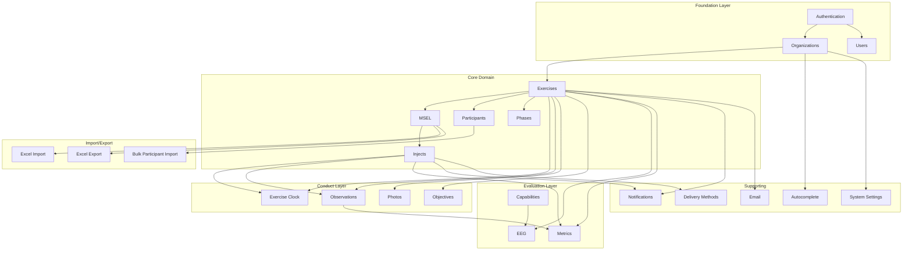

# Feature Inventory

> **Last Updated:** 2026-03-06 | **Version:** 2.0

Complete cross-reference of every feature in Cadence with backend and frontend file locations, implementation status, test coverage, and dependencies.

---

## Inventory Summary

| Metric | Count |
|--------|-------|
| Total features | 28 |
| Backend feature modules | 26 |
| Frontend feature modules | 25 |
| API controllers | 36 |
| Backend test files | 47 |
| Frontend test files | 133 |

---

## Feature Cross-Reference

### Exercise Management

| Feature | Status | Backend Module | Frontend Module | Controllers | Backend Tests | Frontend Tests |
|---------|--------|----------------|-----------------|-------------|---------------|----------------|
| **Exercise CRUD** | Complete | `Exercises/` | `exercises/` | ExercisesController | 7 | 33 |
| **Exercise Status Transitions** | Complete | `Exercises/` | `exercises/` | ExerciseStatusController | ExerciseStatusServiceTests | useExerciseStatus |
| **Exercise Participants** | Complete | `Exercises/` | `exercises/` | ExerciseParticipantsController | ExerciseAssignmentServiceTests | useExerciseParticipants.test |
| **Exercise Settings** | Complete | `Exercises/` | `exercises/` | ExercisesController | - | - |
| **Exercise Delete** | Complete | `Exercises/` | `exercises/` | ExercisesController | ExerciseDeleteServiceTests | - |
| **Setup Progress** | Complete | `Exercises/` | `exercises/` | ExercisesController | - | - |
| **Exercise Capabilities** | Complete | `Exercises/` | `exercises/` | ExerciseCapabilitiesController | ExerciseCapabilityServiceTests | - |

### MSEL & Inject Management

| Feature | Status | Backend Module | Frontend Module | Controllers | Backend Tests | Frontend Tests |
|---------|--------|----------------|-----------------|-------------|---------------|----------------|
| **MSEL Management** | Complete | `Msel/` | `exercises/` | ExercisesController | - | - |
| **Inject CRUD** | Complete | `Injects/` | `injects/` | InjectsController | InjectServiceTests | 28 |
| **Inject Status Transitions** | Complete | `Injects/` | `injects/` | InjectsController | InjectServiceTests | injectService.test |
| **Inject Approval Workflow** | Complete | `Exercises/` | `injects/` | InjectsController | ExerciseApprovalQueueTests, ExerciseApprovalSettingsServiceTests | useInjectApproval |
| **Inject Readiness (Auto-Ready)** | Complete | `Injects/` | `injects/` | InjectsController | InjectReadinessServiceTests | - |
| **Expected Outcomes** | Complete | `ExpectedOutcomes/` | `expected-outcomes/` | ExpectedOutcomesController | - | - |
| **Phases** | Complete | `Phases/` | `phases/` | PhasesController | PhasesControllerTests | 4 |

### Exercise Conduct

| Feature | Status | Backend Module | Frontend Module | Controllers | Backend Tests | Frontend Tests |
|---------|--------|----------------|-----------------|-------------|---------------|----------------|
| **Exercise Clock** | Complete | `ExerciseClock/` | `exercise-clock/` | ExerciseClockController | ExerciseClockServiceTests | 7 |
| **Observations** | Complete | `Observations/` | `observations/` | ObservationsController | ObservationServiceTests | 3 |
| **Objectives** | Complete | `Objectives/` | `objectives/` | ObjectivesController | - | - |
| **Photos** | Complete | `Photos/` | `photos/` | PhotosController | PhotoServiceTests | 3 |

### Evaluation & Reporting

| Feature | Status | Backend Module | Frontend Module | Controllers | Backend Tests | Frontend Tests |
|---------|--------|----------------|-----------------|-------------|---------------|----------------|
| **EEG (Exercise Evaluation Guide)** | Complete | `Eeg/` | `eeg/` | EegEntriesController, CriticalTasksController, CapabilityTargetsController | CriticalTaskServiceTests, EegDocumentServiceTests | 5 |
| **Capabilities Library** | Complete | `Capabilities/` | `capabilities/` | CapabilitiesController | CapabilityServiceTests, CapabilityImportServiceTests, PredefinedLibraryProviderTests | 3 |
| **Metrics Dashboard** | Complete | `Metrics/` | `metrics/` | ExerciseMetricsController | ExerciseMetricsServiceTests | - |

### Import & Export

| Feature | Status | Backend Module | Frontend Module | Controllers | Backend Tests | Frontend Tests |
|---------|--------|----------------|-----------------|-------------|---------------|----------------|
| **Excel Import** | Complete | `ExcelImport/` | `excel-import/` | ExcelImportController | ExcelImportServiceTests, TimeParsingHelperTests | 1 |
| **Excel Export** | Complete | `ExcelExport/` | `excel-export/` | ExcelExportController | ExcelExportServiceTests | 4 |
| **Bulk Participant Import** | Complete | `BulkParticipantImport/` | `exercises/` | BulkParticipantImportController | BulkParticipantImportServiceTests, ParticipantClassificationServiceTests, ParticipantFileParserTests | useParticipantImport.test |

### Organization & Identity

| Feature | Status | Backend Module | Frontend Module | Controllers | Backend Tests | Frontend Tests |
|---------|--------|----------------|-----------------|-------------|---------------|----------------|
| **Organizations** | Complete | `Organizations/` | `organizations/` | OrganizationsController, AdminOrganizationsController | OrganizationServiceTests, MembershipServiceTests, OrganizationInvitationServiceTests | 6 |
| **Authentication** | Complete | `Authentication/` | `auth/` | AuthController | AuthenticationServiceTests, JwtTokenServiceTests, RefreshTokenStoreTests | 13 |
| **User Management** | Complete | `Users/` | `users/` | UsersController | UserServiceTests, UserPreferencesServiceTests | 4 |
| **Assignments** | Complete | `Assignments/` | `assignments/` | AssignmentsController | AssignmentServiceTests | 3 |
| **Authorization** | Complete | `Authorization/` | `auth/` | - | RoleResolverTests | useExerciseRole.test |

### Communication

| Feature | Status | Backend Module | Frontend Module | Controllers | Backend Tests | Frontend Tests |
|---------|--------|----------------|-----------------|-------------|---------------|----------------|
| **Email System** | Complete | `Email/` | `settings/` | EmailPreferencesController | 6 | - |
| **Notifications** | Complete | `Notifications/` | `notifications/` | NotificationsController | NotificationServiceTests, ApprovalNotificationServiceTests | 8 |
| **Feedback** | Complete | `Feedback/` | `feedback/` | FeedbackController | - | - |

### Platform Features

| Feature | Status | Backend Module | Frontend Module | Controllers | Backend Tests | Frontend Tests |
|---------|--------|----------------|-----------------|-------------|---------------|----------------|
| **System Settings** | Complete | `SystemSettings/` | `settings/` | SystemSettingsController | SystemSettingsServiceTests, EulaServiceTests, EmailConfigurationProviderTests | - |
| **EULA** | Complete | `SystemSettings/` | `eula/` | EulaController | EulaServiceTests | 1 |
| **Delivery Methods** | Complete | `DeliveryMethods/` | `delivery-methods/` | DeliveryMethodsController | - | - |
| **Autocomplete** | Complete | `Autocomplete/` | `autocomplete/` | AutocompleteController, OrganizationSuggestionsController | - | - |
| **Version / About** | Complete | - | `version/` | VersionController, HealthController | - | 5 |
| **Home / Dashboard** | Complete | - | `home/` | - | - | 2 |

---

## Feature Dependencies

---

## Test Coverage Analysis

### Well-Tested Features (Backend + Frontend)

| Feature | Backend Tests | Frontend Tests | Total |
|---------|--------------|----------------|-------|
| Exercises | 7 | 33 | 40 |
| Injects | 2 | 28 | 30 |
| Authentication | 3 | 13 | 16 |
| Notifications | 2 | 8 | 10 |
| Organizations | 3 | 6 | 9 |
| Exercise Clock | 1 | 7 | 8 |
| Email | 6 | 0 | 6 |
| EEG | 2 | 5 | 7 |
| Excel Export | 1 | 4 | 5 |
| Version/About | 0 | 5 | 5 |

### Features Missing Tests

| Feature | Backend Tests | Frontend Tests | Risk |
|---------|--------------|----------------|------|
| Delivery Methods | 0 | 0 | Low (simple CRUD) |
| Autocomplete | 0 | 0 | Low (suggestions) |
| Feedback | 0 | 0 | Low (fire-and-forget) |
| Expected Outcomes | 0 | 0 | Low (simple CRUD) |
| Objectives | 0 | 0 | Low (simple CRUD) |
| Metrics | 1 | 0 | Medium (calculations) |
| Settings | 3 | 0 | Medium (system config) |

---

## Key Entry Points

### Backend Entry Points

| Feature | Controller | Key Method | Route |
|---------|-----------|------------|-------|
| Create exercise | ExercisesController | `CreateExercise` | `POST /api/exercises` |
| Fire inject | InjectsController | `FireInject` | `POST /api/exercises/{id}/injects/{id}/fire` |
| Start clock | ExerciseClockController | `StartClock` | `POST /api/exercises/{id}/clock/start` |
| Add observation | ObservationsController | `CreateObservation` | `POST /api/exercises/{id}/observations` |
| Import MSEL | ExcelImportController | `ImportMsel` | `POST /api/import/exercises/{id}/msel` |
| Login | AuthController | `Login` | `POST /api/auth/login` |
| Switch org | OrganizationsController | `SwitchOrganization` | `POST /api/organizations/{id}/switch` |

### Frontend Entry Points

| Feature | Page Component | Route |
|---------|---------------|-------|
| Exercise list | ExerciseListPage | `/exercises` |
| Exercise conduct | ExerciseConductPage | `/exercises/:id/conduct` |
| Inject list | InjectListPage | `/exercises/:id/injects` |
| Observations | ObservationsPage | `/exercises/:id/observations` |
| Metrics | ExerciseMetricsPage | `/exercises/:id/metrics` |
| Organizations | OrganizationListPage | `/organizations` |
| User settings | UserSettingsPage | `/settings` |

---

## File Location Quick Reference

### Finding Feature Code

| Looking for... | Backend Path | Frontend Path |
|----------------|-------------|---------------|
| Exercise logic | `Core/Features/Exercises/Services/` | `features/exercises/hooks/` |
| Inject logic | `Core/Features/Injects/Services/` | `features/injects/hooks/` |
| Clock logic | `Core/Features/ExerciseClock/Services/` | `features/exercise-clock/hooks/` |
| Observation logic | `Core/Features/Observations/Services/` | `features/observations/hooks/` |
| Organization logic | `Core/Features/Organizations/Services/` | `features/organizations/hooks/` |
| Auth logic | `Core/Features/Authentication/Services/` | `features/auth/services/` |
| API endpoints | `WebApi/Controllers/` | `features/*/services/*Service.ts` |
| DTOs | `Core/Features/*/Models/DTOs/` | `features/*/types/` or `types/index.ts` |
| Entities | `Core/Models/Entities/` | - |
| SignalR events | `Core/Hubs/IExerciseHubContext.cs` | `shared/hooks/useSignalR.ts` |
| Authorization | `WebApi/Authorization/` | `features/auth/hooks/useExerciseRole.ts` |
| Styling | - | `theme/` |
| Global types | - | `types/index.ts` |

---

## Related Documents

- [OVERVIEW.md](./OVERVIEW.md) - System architecture and deployment
- [DATA_MODEL.md](./DATA_MODEL.md) - Entity relationships and database schema
- [API_DESIGN.md](./API_DESIGN.md) - REST API endpoint catalog
- [ROLE_ARCHITECTURE.md](./ROLE_ARCHITECTURE.md) - Three-tier role hierarchy
- [FRONTEND_ARCHITECTURE.md](./FRONTEND_ARCHITECTURE.md) - React application map
- [BACKEND_ARCHITECTURE.md](./BACKEND_ARCHITECTURE.md) - .NET service layer map
- [SIGNALR_EVENTS.md](./SIGNALR_EVENTS.md) - Real-time event reference
