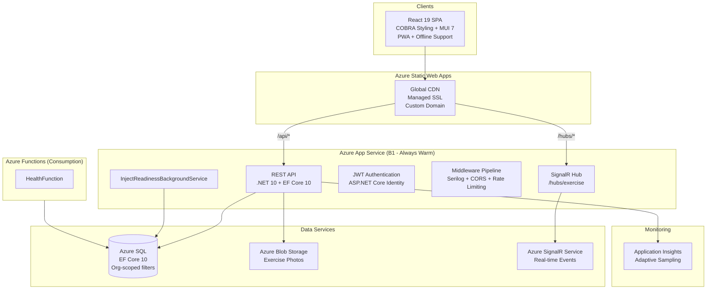
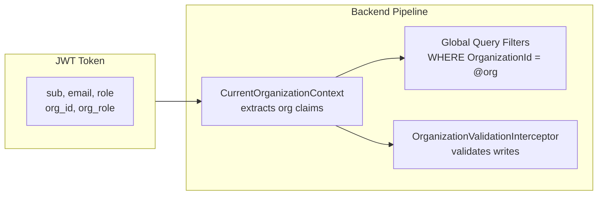
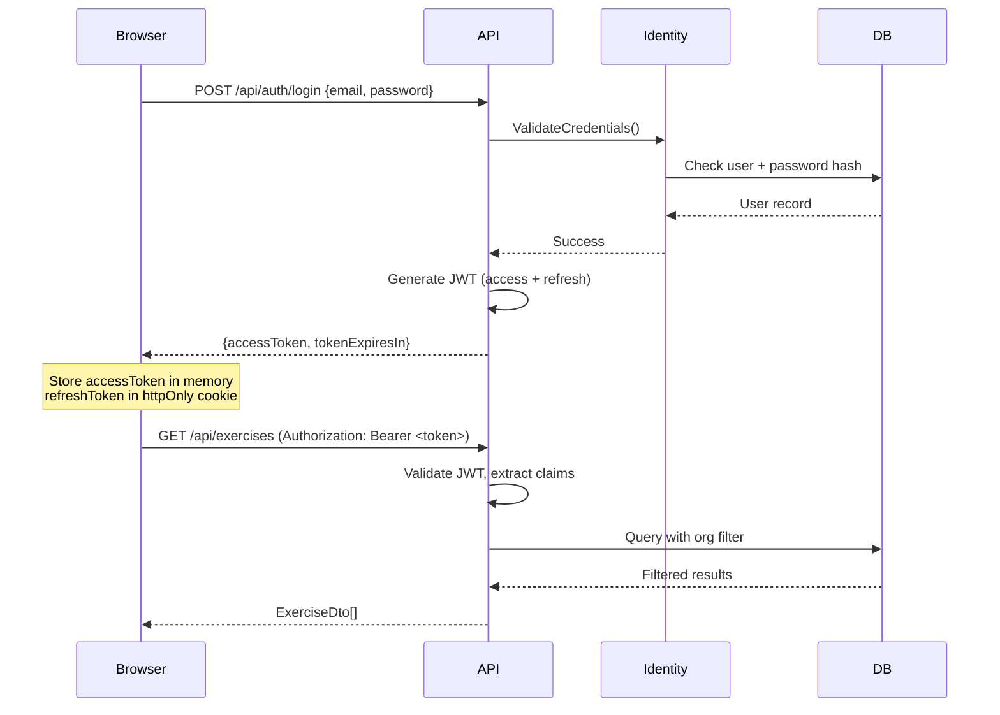
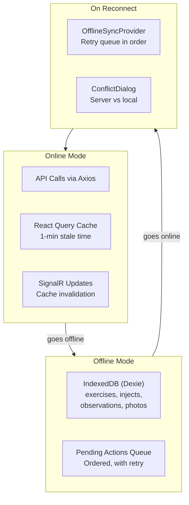

# Architecture Overview

> **Last Updated:** 2026-03-06 | **Version:** 2.0

This document describes the high-level architecture of Cadence, a HSEEP-compliant MSEL management platform.

---

## System Architecture



### Why App Service + Functions Hybrid?

| Component | Host | Reason |
|-----------|------|--------|
| REST API | **App Service (B1)** | Always warm - no cold starts for real-time exercise conduct |
| SignalR Hub | App Service | Persistent WebSocket connections need always-on host |
| Background Service | App Service | `InjectReadinessBackgroundService` monitors clock-driven inject readiness |
| Health Check | Azure Functions | Lightweight, scale-to-zero |

---

## Project Structure

```
cadence/
├── src/
│   ├── Cadence.Core/            # Domain logic (no web dependencies)
│   │   ├── Models/Entities/     # 39 entity classes + enums
│   │   ├── Features/            # 32 feature modules (services, DTOs, mappers)
│   │   ├── Data/                # AppDbContext, interceptors, seeders
│   │   ├── Hubs/                # IExerciseHubContext interface (abstraction only)
│   │   └── Migrations/          # 125+ EF Core migrations
│   │
│   ├── Cadence.WebApi/          # ASP.NET Core API (App Service)
│   │   ├── Controllers/         # 35 API controllers
│   │   ├── Hubs/                # ExerciseHub + ExerciseHubContext (SignalR)
│   │   ├── Authorization/       # Exercise access/role handlers
│   │   ├── Middleware/          # Serilog context + request logging
│   │   └── Program.cs           # Pipeline configuration
│   │
│   ├── Cadence.Functions/       # Azure Functions (background jobs)
│   │
│   ├── Cadence.Core.Tests/      # Backend unit/integration tests
│   │
│   └── frontend/                # React SPA
│       └── src/
│           ├── features/        # 26 feature modules
│           ├── core/            # API client, offline sync, telemetry
│           ├── shared/          # Reusable components, hooks, constants
│           ├── contexts/        # AuthContext, OrganizationContext
│           ├── theme/           # COBRA styling system
│           └── types/           # Global TypeScript types
│
├── docs/
│   ├── architecture/            # This directory
│   ├── features/                # Feature specifications and stories
│   ├── deployment/              # Deployment guides
│   ├── COBRA_STYLING.md
│   └── CODING_STANDARDS.md
│
├── .github/workflows/           # CI/CD pipelines (11 workflows)
└── scripts/                     # Development scripts
```

---

## Core vs WebApi Separation

The backend follows the **Dependency Inversion Principle** with two projects:

| Project | Purpose | Dependencies |
|---------|---------|-------------|
| **Cadence.Core** | Domain logic, entities, services, data access | EF Core, FluentValidation, Identity (no ASP.NET Core, no SignalR) |
| **Cadence.WebApi** | HTTP pipeline, controllers, SignalR hubs | ASP.NET Core, SignalR, references Core |

**Key pattern:** `IExerciseHubContext` is defined in Core (interface only). The SignalR implementation `ExerciseHubContext` lives in WebApi. This keeps Core testable without web infrastructure dependencies.

---

## Multi-Tenancy Model

Organization is the primary security and data isolation boundary.



- **Read-side:** Global query filters on `AppDbContext` automatically scope all queries to the current organization
- **Write-side:** `OrganizationValidationInterceptor` validates that entities being saved belong to the current organization
- **SysAdmin bypass:** System Admins can access data across organizations

See [ROLE_ARCHITECTURE.md](./ROLE_ARCHITECTURE.md) for the full three-tier role hierarchy.

---

## Authentication Flow



**Token management:**
- Access token: In-memory (React state), short-lived
- Refresh token: httpOnly cookie, long-lived
- Proactive refresh: Timer fires 2 minutes before expiry
- Single-flight: Concurrent 401s share one refresh request

---

## HTTP Pipeline (Program.cs)

The middleware pipeline executes in this order:

```
Request
  │
  ├── OpenAPI / Scalar (API docs)
  ├── HTTPS Redirection
  ├── Static Files (local photo uploads)
  ├── CORS
  ├── Rate Limiter (auth: 10/min, password-reset: 3/15min)
  ├── Request/Response Logging (4xx/5xx with body details)
  ├── Authentication (JWT Bearer validation)
  ├── SerilogContextMiddleware (enrich logs with UserId, OrgId)
  ├── Authorization (policies + exercise access handlers)
  ├── Serilog Request Logging (structured HTTP summaries)
  ├── Global Exception Handler
  │
  ├── MapControllers() → 35 API controllers
  └── MapHub<ExerciseHub>("/hubs/exercise")
```

---

## Data Seeding Strategy

```
Application Startup
  │
  ├── Stage 1: EssentialDataSeeder (ALL environments)
  │   ├── Apply pending migrations
  │   ├── Create default organization
  │   ├── Seed HSEEP roles (ExerciseDirector, Controller, Evaluator, Observer)
  │   └── Seed delivery methods (In-Person, Virtual, Phone, etc.)
  │
  └── Stage 2: DemoDataSeeder (non-Production, non-Testing only)
      ├── Create demo organization
      ├── Create demo users (incrementally)
      ├── Create sample exercises with injects
      └── Seed beta feature data
```

---

## Real-Time Architecture

SignalR is used for live updates during exercise conduct.

- **Hub endpoint:** `/hubs/exercise`
- **Groups:** `exercise-{exerciseId}` (exercise participants), `user-{userId}` (notifications)
- **Azure SignalR Service:** Optional, configured via `Azure:SignalR:Enabled`
- **Fallback:** In-process SignalR for local development

See [SIGNALR_EVENTS.md](./SIGNALR_EVENTS.md) for the complete event catalog.

---

## Offline Architecture

The frontend supports offline operation via Progressive Web App (PWA) capabilities:



**Service Worker strategy:**
- API calls: `NetworkOnly` (app-level sync handles caching)
- Fonts: `CacheFirst` (1-year expiry)
- Images: `CacheFirst` (30-day expiry)

---

## Frontend Context Provider Hierarchy

The React app uses a deep provider stack for global state:

```
QueryClientProvider (React Query)
  └── ThemeProvider (MUI base)
      └── ErrorBoundary
          └── AuthProvider (JWT tokens, login/logout)
              └── OrganizationProvider (memberships, org switching)
                  └── UserPreferencesProvider (theme preference)
                      └── ThemedApp (applies user-selected theme)
                          └── EulaGate (agreement check)
                              └── ExerciseNavigationProvider
                                  └── ConnectivityProvider (online/offline)
                                      └── OfflineSyncProvider
                                          └── MobileBlocker
                                              └── FeatureFlagsProvider
                                                  └── NotificationToastProvider
                                                      └── WhatsNewProvider
                                                          └── RouterProvider
```

---

## Deployment Architecture

| Resource | SKU | Monthly Cost | Purpose |
|----------|-----|-------------|---------|
| App Service | B1 | ~$13 | Primary API + SignalR (always warm) |
| Azure SQL | Basic | ~$5 | Application database |
| SignalR Service | Free | $0 | Real-time WebSocket management |
| Functions | Consumption | ~$0-1 | Health checks |
| Static Web Apps | Standard | Included | React SPA hosting + CDN |
| Storage Account | Standard LRS | ~$0.50 | Photo blob storage |
| Application Insights | Standard | ~varies | Monitoring + telemetry |
| **Total** | | **~$20/month** |

### CI/CD Pipelines

| Workflow | Trigger | Purpose |
|----------|---------|---------|
| `ci.yml` | Push/PR to main | Build, test, security audit |
| `deploy-backend.yml` | CI success / manual | Deploy .NET API to App Service |
| `deploy-frontend.yml` | CI success / manual | Deploy React SPA to Static Web Apps |
| `deploy-infrastructure.yml` | Manual | Provision Azure resources |
| `security-dast.yml` | Weekly + manual | OWASP ZAP scanning (auth + baseline) |
| `security-sast.yml` | Weekly + PR/push | Semgrep static analysis |
| `security-report.yml` | Post-scans | Consolidate SARIF findings |
| `commitlint.yml` | On commits | Validate conventional commits |
| `release-please.yml` | Push to main | Automated versioning + changelog |

---

## Related Documents

- [DATA_MODEL.md](./DATA_MODEL.md) - Entity relationships and database schema
- [API_DESIGN.md](./API_DESIGN.md) - REST API endpoint catalog
- [ROLE_ARCHITECTURE.md](./ROLE_ARCHITECTURE.md) - Three-tier role hierarchy
- [FRONTEND_ARCHITECTURE.md](./FRONTEND_ARCHITECTURE.md) - React application map
- [BACKEND_ARCHITECTURE.md](./BACKEND_ARCHITECTURE.md) - .NET service layer map
- [FEATURE_INVENTORY.md](./FEATURE_INVENTORY.md) - Complete feature catalog
- [SIGNALR_EVENTS.md](./SIGNALR_EVENTS.md) - Real-time event reference
