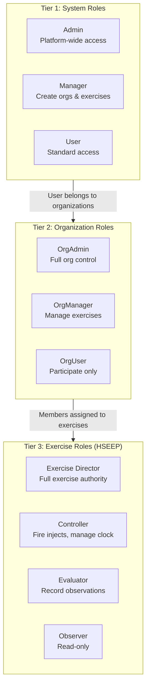
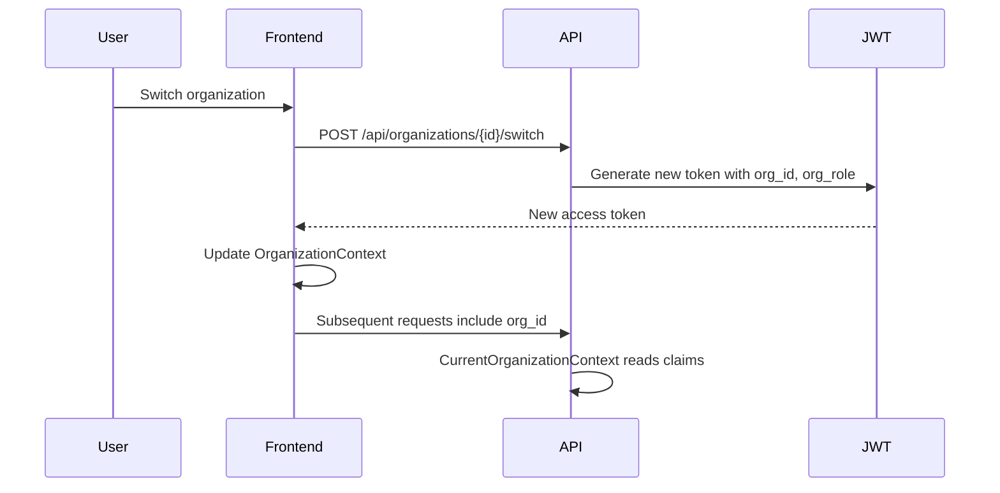
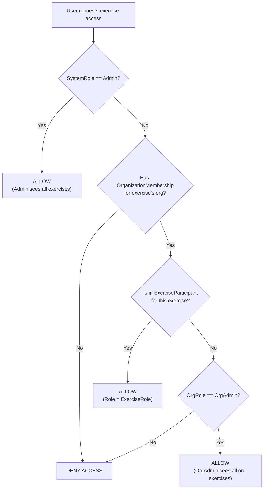

# Cadence Role Architecture

> **Last Updated:** 2026-03-06 | **Version:** 2.0

Cadence uses a **three-tier role hierarchy** to separate platform administration, organization management, and exercise participation.

---

## Three-Tier Role Hierarchy



### Tier Details

| Tier | Enum | Stored On | Scope | Values |
|------|------|-----------|-------|--------|
| **System** | `SystemRole` | `ApplicationUser.Role` | Platform-wide | User(0), Manager(1), Admin(2) |
| **Organization** | `OrgRole` | `OrganizationMembership.Role` | Per-organization | OrgAdmin(1), OrgManager(2), OrgUser(3) |
| **Exercise** | `ExerciseRole` | `ExerciseParticipant.Role` | Per-exercise | Administrator(1), ExerciseDirector(2), Controller(3), Evaluator(4), Observer(5) |

---

## Tier 1: System Roles

"What can you do in the **platform**?"

| Role | Permissions |
|------|------------|
| **Admin** | All platform access: manage all organizations, all users, system settings. Bypass organization scoping. |
| **Manager** | Create organizations, manage exercises they create. Auto-becomes Director when creating exercises. |
| **User** | Standard access. Must belong to an organization. Can only access assigned exercises. |

**Key files:**
- Enum: `src/Cadence.Core/Models/Entities/Enums.cs` (`SystemRole`)
- Stored on: `ApplicationUser.Role` property
- JWT claim: `role`

---

## Tier 2: Organization Roles

"What can you do in **this organization**?"

| Role | Permissions |
|------|------------|
| **OrgAdmin** | Full organization control: manage members, settings, all exercises within the org. |
| **OrgManager** | Create and manage exercises within the organization. Invite members. |
| **OrgUser** | Participate in exercises they are assigned to within the organization. |

**Key files:**
- Enum: `src/Cadence.Core/Models/Entities/Enums.cs` (`OrgRole`)
- Stored on: `OrganizationMembership.Role` property
- JWT claim: `org_role`
- Context: `ICurrentOrganizationContext` (backend), `OrganizationContext` (frontend)

**Organization context flow:**


---

## Tier 3: Exercise Roles (HSEEP)

"What's your **function** in **this exercise**?"

| Role | Permissions |
|------|------------|
| **Exercise Director** | Full exercise authority: assign participants, manage settings, Go/No-Go decisions, all permissions below |
| **Controller** | Fire injects, manage exercise clock, edit MSEL, approve injects (if configured), all permissions below |
| **Evaluator** | Capture observations, rate performance (P/S/M/U), create EEG entries |
| **Observer** | Read-only access to exercise data |

**Same user, different roles per exercise:**
- A user can be Director in one exercise and Observer in another
- Role assignment is independent across exercises

**Key files:**
- Enum: `src/Cadence.Core/Models/Entities/Enums.cs` (`ExerciseRole`)
- Stored on: `ExerciseParticipant.Role` property
- Frontend context: `ExerciseNavigationContext` (stores `userRole` in sessionStorage)

---

## Permission Resolution



### Authorization Implementation

| Component | File | Purpose |
|-----------|------|---------|
| `ExerciseAccessHandler` | `WebApi/Authorization/ExerciseAccessHandler.cs` | Verifies user can access exercise |
| `ExerciseRoleHandler` | `WebApi/Authorization/ExerciseRoleHandler.cs` | Verifies user has specific exercise role |
| `AuthorizationLoggingHandler` | `WebApi/Authorization/AuthorizationLoggingHandler.cs` | Logs authorization decisions |
| `ExerciseAccessRequirement` | `WebApi/Authorization/ExerciseAccessRequirement.cs` | Generic exercise access policy |
| `ExerciseRoleRequirement` | `WebApi/Authorization/ExerciseRoleRequirement.cs` | Specific role check policy |

---

## Real-World Example

```
Sarah (System: Admin, Org: OrgAdmin @ "City EOC")
├── Hurricane Response TTX ..... ExerciseDirector  ← She created it
├── Cyber Incident Exercise .... Observer           ← Just watching
└── Regional Coordination ...... (none)             ← Can view as Admin

Bob (System: Manager, Org: OrgManager @ "City EOC")
├── Hurricane Response TTX ..... Controller         ← Helping Sarah
├── Cyber Incident Exercise .... ExerciseDirector   ← He created it
└── Regional Coordination ...... (none)             ← Not assigned, can't see

Carol (System: User, Org: OrgUser @ "City EOC", OrgUser @ "County EM")
├── Hurricane Response TTX ..... Evaluator          ← Assigned to evaluate
├── Cyber Incident Exercise .... (none)             ← Not assigned, can't see
└── County Flood Exercise ...... Controller         ← Different org exercise

Dave (System: User, Org: OrgUser @ "City EOC")
├── Hurricane Response TTX ..... Observer            ← Learning
└── (no other exercises visible)
```

---

## JWT Claims Structure

```json
{
  "sub": "user-guid",
  "email": "sarah@example.com",
  "name": "Sarah Johnson",
  "role": "Admin",
  "org_id": "org-guid",
  "org_name": "City EOC",
  "org_role": "OrgAdmin",
  "exp": 1709769600,
  "iss": "Cadence",
  "aud": "CadenceApp"
}
```

Exercise role is NOT in the JWT - it's resolved per-request from the `ExerciseParticipant` table.

---

## Key Rules

| Rule | Description |
|------|-------------|
| **Admin Override** | System Admins can see all exercises across all organizations but don't get Director powers unless explicitly assigned |
| **OrgAdmin Override** | OrgAdmins can see all exercises within their organization |
| **Exercise Creation** | Manager/OrgManager creates exercise -> auto-assigned as ExerciseDirector |
| **Last Admin Protection** | Cannot demote or deactivate the last System Admin |
| **Last Director Protection** | Cannot remove or demote the last ExerciseDirector from an exercise |
| **Role Independence** | Changing SystemRole doesn't affect ExerciseRole assignments |
| **Org Switching** | Users can belong to multiple organizations; switching org re-issues JWT with new `org_id`/`org_role` |
| **Pending Users** | New users without organization membership see a pending state until added to an org |

---

## Inject Approval Roles

The approval workflow adds a cross-cutting permission layer on top of exercise roles:

| Setting | Enum | Purpose |
|---------|------|---------|
| `ApprovalPolicy` | Disabled, Optional, Required | Organization-level policy |
| `SelfApprovalPolicy` | NeverAllowed, AllowedWithWarning, AlwaysAllowed | Self-approval restrictions |
| `ApprovalRoles` | Flags: Administrator(1), ExerciseDirector(2), Controller(4), Evaluator(8) | Which roles can approve |

**Note:** `ApprovalRoles` is a `[Flags]` enum serialized as integer (not string) for frontend bitwise operations.
