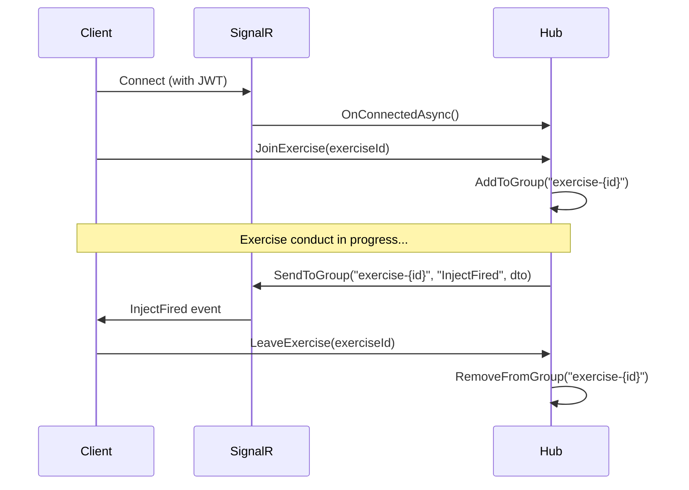

# SignalR Real-Time Events Reference

> **Last Updated:** 2026-03-06 | **Version:** 1.0

This document catalogs all SignalR events broadcast by the Cadence backend during exercise conduct.

---

## Hub Configuration

| Setting | Value |
|---------|-------|
| Hub endpoint | `/hubs/exercise` |
| Hub class | `ExerciseHub` (`Cadence.WebApi/Hubs/ExerciseHub.cs`) |
| Hub context interface | `IExerciseHubContext` (`Cadence.Core/Hubs/IExerciseHubContext.cs`) |
| Hub context implementation | `ExerciseHubContext` (`Cadence.WebApi/Hubs/ExerciseHubContext.cs`) |
| JSON serialization | camelCase properties, string enums, ApprovalRoles as integer |
| Azure SignalR | Optional (`Azure:SignalR:Enabled` config flag) |

---

## Group Management

Clients join/leave groups to receive scoped events:

| Group Pattern | Scope | Join Method | Leave Method |
|---------------|-------|-------------|--------------|
| `exercise-{exerciseId}` | All participants of an exercise | `JoinExercise(exerciseId)` | `LeaveExercise(exerciseId)` |
| `user-{userId}` | Individual user notifications | `JoinUserGroup(userId)` | `LeaveUserGroup(userId)` |

---

## Event Catalog

### Inject Events

All inject events broadcast to the `exercise-{exerciseId}` group. Most also trigger `InjectStatusChanged` for generic listeners.

| Event | Method | Payload | When |
|-------|--------|---------|------|
| `InjectFired` | `NotifyInjectFired` | `InjectDto` | Controller fires an inject (status -> Released) |
| `InjectSkipped` | `NotifyInjectSkipped` | `InjectDto` | Controller skips an inject (status -> Deferred) |
| `InjectReset` | `NotifyInjectReset` | `InjectDto` | Inject reset to previous state |
| `InjectReadyToFire` | `NotifyInjectReadyToFire` | `InjectDto` | Clock reaches inject's delivery time (clock-driven mode) |
| `InjectStatusChanged` | `NotifyInjectStatusChanged` | `InjectDto` | Generic status change (also sent alongside specific events) |
| `InjectSubmitted` | `NotifyInjectSubmitted` | `InjectDto` | Inject submitted for approval (Draft -> Submitted) |
| `InjectApproved` | `NotifyInjectApproved` | `InjectDto` | Inject approved (Submitted -> Approved) |
| `InjectRejected` | `NotifyInjectRejected` | `InjectDto` | Inject rejected (Submitted -> Draft) |
| `InjectReverted` | `NotifyInjectReverted` | `InjectDto` | Approval reverted (Approved -> Submitted) |
| `InjectsReordered` | `NotifyInjectsReordered` | `List<Guid>` | Inject sequence order changed |

### Clock Events

| Event | Method | Payload | When |
|-------|--------|---------|------|
| `ClockStarted` | `NotifyClockStarted` | `ClockStateDto` | Exercise clock started |
| `ClockPaused` | `NotifyClockPaused` | `ClockStateDto` | Exercise clock paused |
| `ClockStopped` | `NotifyClockStopped` | `ClockStateDto` | Exercise clock stopped |

### Observation Events

| Event | Method | Payload | When |
|-------|--------|---------|------|
| `ObservationAdded` | `NotifyObservationAdded` | `ObservationDto` | New observation created |
| `ObservationUpdated` | `NotifyObservationUpdated` | `ObservationDto` | Observation edited |
| `ObservationDeleted` | `NotifyObservationDeleted` | `Guid` (observationId) | Observation deleted |

### Exercise Events

| Event | Method | Payload | When |
|-------|--------|---------|------|
| `ExerciseStatusChanged` | `NotifyExerciseStatusChanged` | `ExerciseDto` | Status transition (Draft -> Active -> Paused -> Completed -> Archived) |

### EEG Events

| Event | Method | Payload | When |
|-------|--------|---------|------|
| `EegEntryCreated` | `NotifyEegEntryCreated` | `EegEntryDto` | New EEG evaluation entry |
| `EegEntryUpdated` | `NotifyEegEntryUpdated` | `EegEntryDto` | EEG entry edited |
| `EegEntryDeleted` | `NotifyEegEntryDeleted` | `Guid` (entryId) | EEG entry deleted |

### Photo Events

| Event | Method | Payload | When |
|-------|--------|---------|------|
| `PhotoAdded` | `NotifyPhotoAdded` | `PhotoDto` | New photo uploaded |
| `PhotoUpdated` | `NotifyPhotoUpdated` | `PhotoDto` | Photo metadata updated |
| `PhotoDeleted` | `NotifyPhotoDeleted` | `Guid` (photoId) | Photo deleted |

---

## Frontend Subscription Pattern

### Base SignalR Hook

```
shared/hooks/useSignalR.ts
```

Manages the SignalR connection lifecycle with automatic reconnection.

### Exercise-Scoped Subscriptions

```
features/injects/hooks/useExerciseSignalR.ts (or similar per-feature hooks)
```

**Pattern:**
```typescript
const { connection } = useSignalR();

useEffect(() => {
  if (!connection) return;

  connection.on('InjectFired', (inject: InjectDto) => {
    queryClient.invalidateQueries({ queryKey: ['injects', exerciseId] });
  });

  return () => connection.off('InjectFired');
}, [connection, exerciseId]);
```

**Key behavior:** SignalR events trigger React Query cache invalidation rather than direct state updates. This ensures data consistency through re-fetching from the API.

### Notification Subscriptions

```
features/notifications/hooks/useNotificationSignalR.ts
```

Subscribes to user-scoped notification events via the `user-{userId}` group.

---

## Connection Lifecycle



### Reconnection Strategy

- Auto-reconnect enabled with exponential backoff
- On reconnect: Client re-joins exercise groups
- `ConnectivityContext` tracks connection state for UI indicators

---

## Payload DTO Locations

| DTO | Source File |
|-----|------------|
| `InjectDto` | `Cadence.Core/Features/Injects/Models/DTOs/` |
| `ClockStateDto` | `Cadence.Core/Features/ExerciseClock/Models/DTOs/` |
| `ObservationDto` | `Cadence.Core/Features/Observations/Models/DTOs/` |
| `ExerciseDto` | `Cadence.Core/Features/Exercises/Models/DTOs/` |
| `EegEntryDto` | `Cadence.Core/Features/Eeg/Models/DTOs/` |
| `PhotoDto` | `Cadence.Core/Features/Photos/Models/DTOs/` |
