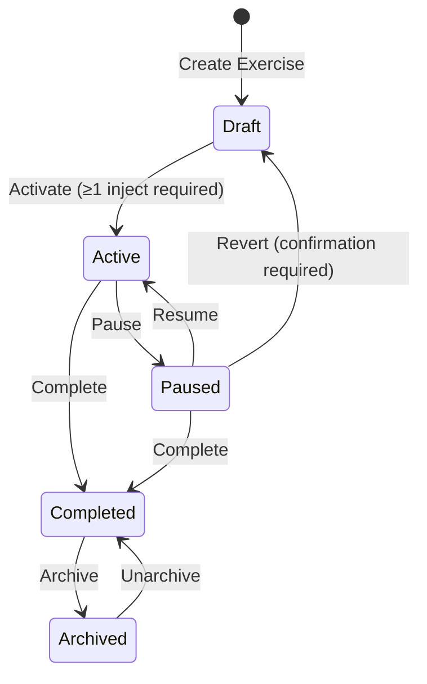

# Feature: Exercise Status Workflow

> **Epic:** Exercise Conduct
> **Phase:** M.2 - Exercise Configuration & Status Management
> **Priority:** P1 - Required for Exercise Conduct

---

## Overview

Exercise status workflow provides HSEEP-compliant lifecycle management for exercises from initial planning through completion and archival. The workflow supports both planned transitions (Draft → Active → Completed) and real-world scenarios requiring pause and resume capabilities.

---

## Business Value

### Problem Statement

Emergency management exercises have distinct lifecycle phases with different access controls, capabilities, and data integrity requirements. Exercise Directors and Controllers need clear, enforceable status transitions that prevent accidental data loss and ensure exercises progress through proper phases.

**Current Pain Points:**
- No pause capability for exercises requiring temporary suspension
- Status transitions lack confirmation dialogs (accidental transitions possible)
- Missing audit trail of who activated/completed exercises
- No clear path to revert exercises that were started prematurely

### Solution

A state machine-based status workflow with:
- Five distinct statuses (Draft, Active, Paused, Completed, Archived)
- Permission-based transition controls (Exercise Director+ only)
- Confirmation dialogs for destructive transitions
- Full audit trail of status changes with timestamps and user IDs

---

## User Personas

| Role | Status Management Needs |
|------|------------------------|
| **Exercise Director** | Full status control - activate, pause, complete, archive |
| **Administrator** | Same as Exercise Director plus system-wide oversight |
| **Controller** | View status, understand exercise state, no transition rights |
| **Evaluator** | View status to understand data collection phase |
| **Observer** | View status only |

---

## Status Definitions

| Status | Description | Editable? | Clock State |
|--------|-------------|-----------|-------------|
| **Draft** | Initial planning state. MSEL being built. | Yes (full edit) | Stopped |
| **Active** | Exercise conduct in progress. | Limited (Controller notes, inject status) | Running |
| **Paused** | Temporarily suspended. Scenario on hold. | Limited (same as Active) | Paused |
| **Completed** | Conduct finished. AAR phase. | No (read-only except observations) | Stopped |
| **Archived** | Historical record. Hidden from default views. | No (read-only) | Stopped |

---

## Status Transition Rules



### Transition Matrix

| From | To | Trigger | Requirements | Confirmation? |
|------|----|---------|--------------| ------------- |
| Draft | Active | "Activate Exercise" | ≥1 inject exists | Yes |
| Active | Paused | "Pause Exercise" | None | No |
| Paused | Active | "Resume Exercise" | None | No |
| Paused | Draft | "Revert to Draft" | None | **YES - Data Loss Warning** |
| Active | Completed | "Complete Exercise" | None | Yes |
| Paused | Completed | "Complete Exercise" | None | Yes |
| Completed | Archived | "Archive Exercise" | None | Yes |
| Archived | Completed | "Unarchive Exercise" | None | No |

---

## Permission Matrix

| Role | Can Transition? |
|------|----------------|
| Administrator | ✅ All transitions |
| Exercise Director | ✅ All transitions |
| Controller | ❌ View only |
| Evaluator | ❌ View only |
| Observer | ❌ View only |

---

## User Stories

| Story | Title | Priority |
|-------|-------|----------|
| S01 | View Exercise Status | P0 |
| S02 | Activate Exercise (Draft → Active) | P0 |
| S03 | Pause Exercise (Active → Paused) | P1 |
| S04 | Complete Exercise (Active/Paused → Completed) | P0 |
| S05 | Revert to Draft (Paused → Draft) | P1 |
| S06 | Archive Exercise (Completed → Archived) | P0 |

**Note:** S06 references existing `exercise-crud/S04-archive-exercise.md` to avoid duplication.

---

## Data Model Changes

### Exercise Entity Additions

```csharp
public class Exercise : BaseEntity
{
    // Existing fields...
    public ExerciseStatus Status { get; set; } = ExerciseStatus.Draft;

    // NEW: Status transition audit fields
    public DateTime? ActivatedAt { get; set; }
    public Guid? ActivatedBy { get; set; }
    public User? ActivatedByUser { get; set; }

    public DateTime? CompletedAt { get; set; }
    public Guid? CompletedBy { get; set; }
    public User? CompletedByUser { get; set; }

    public DateTime? ArchivedAt { get; set; }
    public Guid? ArchivedBy { get; set; }
    public User? ArchivedByUser { get; set; }
}
```

### ExerciseStatus Enum Update

```csharp
public enum ExerciseStatus
{
    Draft,
    Active,
    Paused,      // NEW
    Completed,
    Archived
}
```

---

## Clock State vs Exercise Status (IMPORTANT)

> **Key Design Decision:** Exercise Status and Clock State are **INDEPENDENT** concepts.

The Exercise Clock State and Exercise Status are related but **operate independently**:

| Concept | Purpose | Controls |
|---------|---------|----------|
| **Exercise Status** | Lifecycle phase (planning, conduct, post-conduct) | Permissions, data editability |
| **Clock State** | Timing control (running, paused, stopped) | Inject scheduling, elapsed time |

### Independence Matrix

| Exercise Status | Valid Clock States | Notes |
|----------------|-------------------|-------|
| Draft | Stopped only | Cannot start clock until activated |
| **Active** | **Running OR Paused** | Clock can pause while exercise stays Active |
| **Paused** | Running OR Paused | Exercise paused ≠ clock paused |
| Completed | Stopped | Clock locked |
| Archived | Stopped | Clock locked |

### Why They're Separate

1. **Administrative Pause**: Director may need to pause exercise for safety/administrative reasons while clock keeps running (scenario time continues)
2. **Clock Pause Only**: Controller may pause clock for discussion/clarification while exercise remains Active
3. **Flexibility**: Different exercise types need different relationships between status and clock

### Common Scenarios

| Scenario | Exercise Status | Clock State | Example |
|----------|-----------------|-------------|---------|
| Normal conduct | Active | Running | Exercise in progress |
| Break for lunch | Active | Paused | 30-min break, scenario time frozen |
| Safety issue | **Paused** | Running | Real-world issue, but scenario time continues |
| Hot wash discussion | **Paused** | **Paused** | Both frozen for AAR discussion |
| Extended hold | Paused | Paused | Multi-hour hold, resume later |

### Transition Behavior

| Action | Exercise Status Change | Clock State Change |
|--------|------------------------|-------------------|
| **Activate Exercise** | Draft → Active | Stopped → Running |
| **Pause Exercise** | Active → Paused | No automatic change |
| **Pause Clock** | No change | Running → Paused |
| **Resume Exercise** | Paused → Active | No automatic change |
| **Resume Clock** | No change | Paused → Running |
| **Complete Exercise** | Active/Paused → Completed | Any → Stopped (locked) |

### UI Implications

- "Pause Exercise" button affects **status only**
- "Pause Clock" button affects **clock only**
- Consider combined "Full Pause" action that pauses both
- Display both states clearly in header:
  ```
  Hurricane Response 2025 | Status: Active ● | Clock: Paused ⏸ 02:45:30
  ```

---

## Edge Cases & Business Rules

### 1. Empty MSEL Protection
- **Rule:** Cannot activate exercise with zero injects
- **Validation:** `Draft → Active` transition rejected if `exercise.Msels.SelectMany(m => m.Injects).Count() == 0`
- **Error Message:** "Cannot activate exercise. Add at least one inject to the MSEL before activating."

### 2. Revert to Draft Data Loss
- **Rule:** Reverting from Paused to Draft clears all conduct data
- **Data Cleared:** Inject fired times, inject statuses reset to Pending, observations cleared, clock reset
- **Confirmation:** "This will reset all inject statuses and delete observations. This action cannot be undone. Continue?"

### 3. Pause vs Stop Clock
- **Pause Exercise:** Exercise Status → Paused, Clock State → Paused (preserves elapsed time)
- **Stop Clock:** Clock stops but exercise remains Active (for admin override scenarios)
- **Recommended UX:** "Pause Exercise" button (pauses both status and clock together)

### 4. Archive vs Complete
- **Complete:** Exercise conduct finished, visible in main list, editable observations
- **Archived:** Hidden from default views, read-only, used for long-term storage

### 5. Unarchive Behavior
- **Result:** Returns exercise to Completed status
- **Does NOT:** Revert to Active or Draft (one-way from Archived → Completed only)

---

## Out of Scope (Future Enhancements)

- Auto-complete when all injects fired (requires configuration setting)
- Scheduled activation (activate at specific future time)
- Multi-step activation wizard (pre-flight checks)
- Status-based email notifications
- Bulk status changes (archive multiple exercises)
- Custom status labels per organization

---

## Dependencies

- `exercise-crud/S01`: Create Exercise (must exist to transition)
- `inject-crud/S01`: Create Inject (must have ≥1 inject to activate)
- `exercise-clock/S01`: Start Exercise Clock (coupled with activation)
- `_cross-cutting/S01`: Session Management (role-based permissions)

---

## Testing Considerations

### Critical Test Scenarios

1. **Draft → Active validation:**
   - Reject if zero injects
   - Require confirmation
   - Start clock on activation

2. **Pause/Resume cycle:**
   - Clock state synchronized
   - Elapsed time preserved
   - Multiple pause/resume cycles work correctly

3. **Revert to Draft data loss:**
   - All fired injects reset to Pending
   - Observations cleared
   - Clock elapsed time reset
   - Confirmation required

4. **Permission enforcement:**
   - Controllers cannot transition statuses
   - Exercise Directors can transition all statuses
   - Administrators can transition all statuses

5. **Invalid transitions:**
   - Cannot go from Draft → Completed directly
   - Cannot pause a Completed exercise
   - Cannot activate an Archived exercise

---

## Audit & Compliance

All status transitions MUST be logged with:
- **Action:** Status transition type
- **Timestamp:** When transition occurred
- **User ID:** Who performed transition
- **From/To Status:** Previous and new status
- **IP Address:** (optional) For security auditing

This audit trail supports HSEEP compliance requirements for exercise documentation and after-action review.

---

## UI/UX Principles

### Status Badge Display
- **Draft:** Blue badge, indicates planning phase
- **Active:** Green badge with pulsing animation, indicates live exercise
- **Paused:** Yellow badge, indicates temporary hold
- **Completed:** Gray badge, indicates finished conduct
- **Archived:** Light gray badge, indicates historical record

### Action Button Placement
- Primary action button in exercise detail header
- Dropdown menu for secondary transitions (Revert to Draft, Archive)
- Confirmation dialogs use COBRA styled components

### State-Aware UI
- Hide "Fire Inject" buttons when status is Completed/Archived
- Show read-only indicators on forms when status is not Draft
- Display status badge prominently in exercise list and detail views

---

## Change Log

| Date | Version | Changes |
|------|---------|---------|
| Jan 2026 | 1.0 | Initial feature specification for Phase M.2 |
