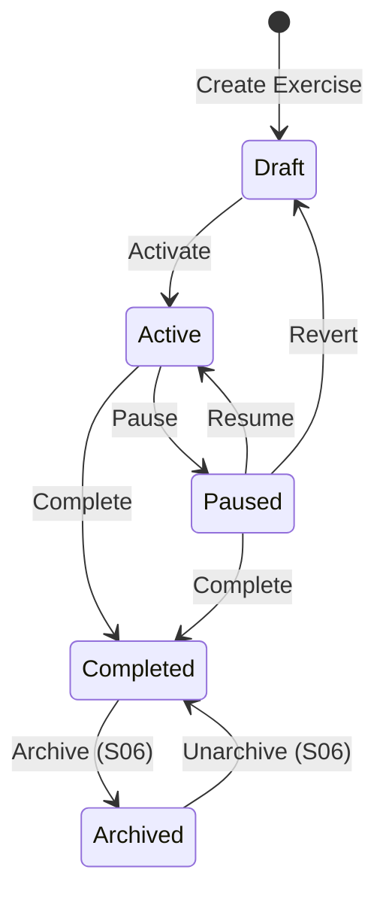

# exercise-status/S06: Archive Exercise (Completed → Archived)

## Story

**As an** Exercise Director or Administrator,
**I want** to archive completed exercises,
**So that** they are removed from the active list while preserving data for future reference and after-action review.

## Context

This story references the existing archive functionality documented in `exercise-crud/S04-archive-exercise.md`. The archive workflow is already designed and implemented as part of the exercise CRUD feature set.

Archiving is the final state in the exercise lifecycle:
- Only Completed exercises can be archived
- Archived exercises are hidden from default views but fully preserved
- Archiving is reversible (can be unarchived back to Completed)
- This completes the status workflow: Draft → Active → Paused → Completed → **Archived**

## Acceptance Criteria

See `exercise-crud/S04-archive-exercise.md` for complete acceptance criteria, including:

- Archive action availability (Exercise Director/Administrator only)
- Archive confirmation dialog
- Status transition to Archived
- Archived exercises hidden from default list views
- "Show Archived" filter to display archived exercises
- Unarchive action to restore to Completed status
- Audit trail for archive/unarchive actions

## Status Workflow Integration

### Status Transition Rule

**From:** Completed
**To:** Archived
**Trigger:** "Archive Exercise" button
**Requirements:**
- Exercise must be in Completed status
- User must be Administrator or Exercise Director
- Confirmation dialog required

### Reverse Transition

**From:** Archived
**To:** Completed
**Trigger:** "Unarchive Exercise" button
**Requirements:**
- Exercise must be in Archived status
- User must be Administrator or Exercise Director
- No confirmation dialog (non-destructive action)

## Dependencies

- exercise-crud/S04: Archive Exercise (existing implementation)
- exercise-status/S01: View Status (status badge must display Archived state)
- exercise-status/S04: Complete Exercise (must be Completed to archive)

## Domain Terms

| Term | Definition |
|------|------------|
| Archive | Action to hide a completed exercise from default views while preserving all data |
| Unarchive | Action to restore an archived exercise to visible (Completed) status |
| Completed Status | Exercise has finished conduct, all activities concluded |
| Archived Status | Exercise hidden from default views, data preserved for historical reference |

## Technical Notes

### Backend Implementation

Archive functionality already exists in `ExercisesController` and `ExerciseService`:
- `POST /api/exercises/{exerciseId}/archive` - Archive endpoint
- `POST /api/exercises/{exerciseId}/unarchive` - Unarchive endpoint

**Status Transition Logic:**
```csharp
// Archive
exercise.Status = ExerciseStatus.Archived;
exercise.ArchivedAt = DateTime.UtcNow;
exercise.ArchivedBy = userId;

// Unarchive
exercise.Status = ExerciseStatus.Completed;
exercise.ArchivedAt = null;
exercise.ArchivedBy = null;
```

### Frontend Implementation

Archive UI components already exist in `exercise-crud` feature:
- Archive button in exercise detail view actions menu
- Archive confirmation dialog
- "Show Archived" filter in exercise list
- Archived status badge styling
- Unarchive button for archived exercises

### Database Schema

Exercise entity already includes archive fields:
```csharp
public DateTime? ArchivedAt { get; set; }
public Guid? ArchivedBy { get; set; }
public User? ArchivedByUser { get; set; }
```

### SignalR Events

**Event Name:** `ExerciseStatusChanged`

**Payload:**
```typescript
{
  exerciseId: string;
  newStatus: ExerciseStatus; // "Archived" or "Completed"
  archivedAt?: string; // ISO timestamp (when archiving)
  archivedBy?: string; // User ID (when archiving)
}
```

## UI/UX Notes

### Archive Button (from exercise-crud/S04)

```
┌────────────────────────────────────────────────────────────┐
│  Exercise: Hurricane Response 2025              [⋮ Menu]   │
│  [Completed]  📍 Houston, TX                               │
│  Final Time: 3:45:20 | Completed Jan 15, 2026 5:00 PM     │
│                                                            │
│  [View AAR]  [Archive Exercise]  [View MSEL]              │
└────────────────────────────────────────────────────────────┘
```

### Archive Confirmation Dialog (from exercise-crud/S04)

```
┌─────────────────────────────────────────────────────┐
│  Archive Exercise                                   │
├─────────────────────────────────────────────────────┤
│                                                     │
│  Archive "Hurricane Response 2025"?                 │
│                                                     │
│  The exercise will be hidden from the exercise      │
│  list but can be restored later.                    │
│                                                     │
│                       [Cancel]  [Archive]           │
└─────────────────────────────────────────────────────┘
```

### Archived Exercise Display (from exercise-crud/S04)

```
┌────────────────────────────────────────────────────────────┐
│  Exercise: Hurricane Response 2025              [⋮ Menu]   │
│  [Archived]  📍 Houston, TX                                │
│  Final Time: 3:45:20 | Archived Jan 20, 2026              │
│                                                            │
│  [Unarchive Exercise]  [View AAR]  [View MSEL]            │
│                                                            │
│  ℹ This exercise is archived (read-only).                 │
└────────────────────────────────────────────────────────────┘
```

## Status Workflow State Diagram



## Implementation Status

**Backend:** ✅ Implemented (exercise-crud/S04)
**Frontend:** ✅ Implemented (exercise-crud/S04)
**Status Integration:** ⚠️ Verify status validation (must be Completed to archive)
**SignalR Events:** ⚠️ Verify ExerciseStatusChanged event fires on archive/unarchive

## Validation Checklist

When implementing exercise status workflow, verify:

- [ ] Cannot archive Draft, Active, or Paused exercises (validation error)
- [ ] Archive button only visible when status is Completed
- [ ] Archived exercises show correct status badge (light gray, "Archived")
- [ ] Archived exercises hidden by default in exercise list
- [ ] "Show Archived" filter displays archived exercises
- [ ] Unarchive button visible when viewing archived exercise
- [ ] Unarchive returns exercise to Completed status (not Active)
- [ ] SignalR broadcasts status change on archive/unarchive
- [ ] ArchivedAt and ArchivedBy fields populated on archive
- [ ] ArchivedAt and ArchivedBy cleared on unarchive

## Out of Scope (from exercise-crud/S04)

- Bulk archive multiple exercises
- Permanent deletion of exercises
- Auto-archiving based on age or date
- Exporting before archiving
- Archive retention policies

---

**Reference Documentation:** `docs/features/exercise-crud/S04-archive-exercise.md`
**Implementation Status:** Existing functionality - integration verification only
**Estimated Effort:** 0.5 days (validate status integration, add tests for Completed→Archived transition validation)
**Testing:** Verify status validation prevents archiving non-Completed exercises, verify SignalR events
